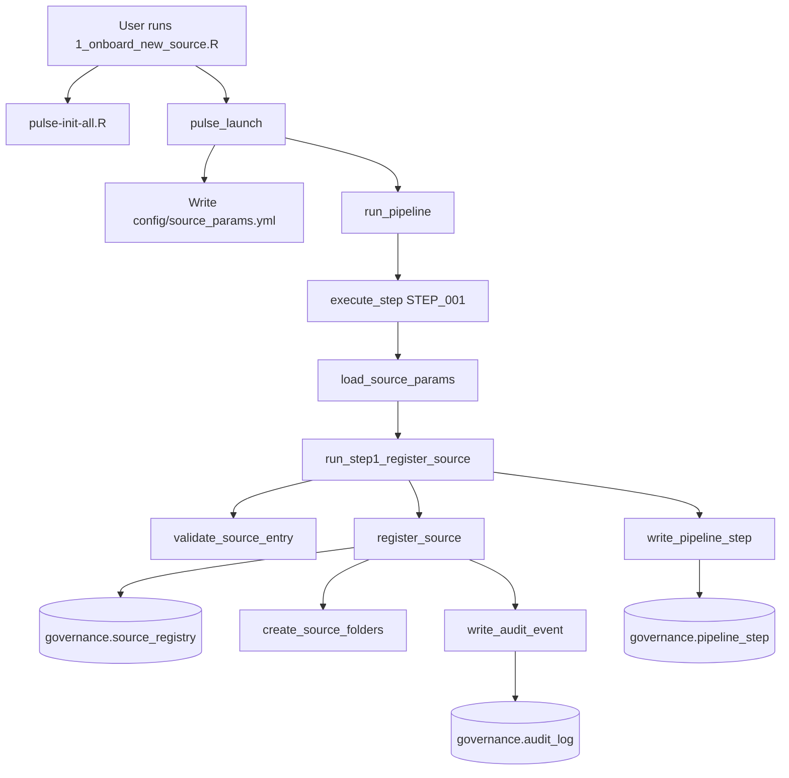
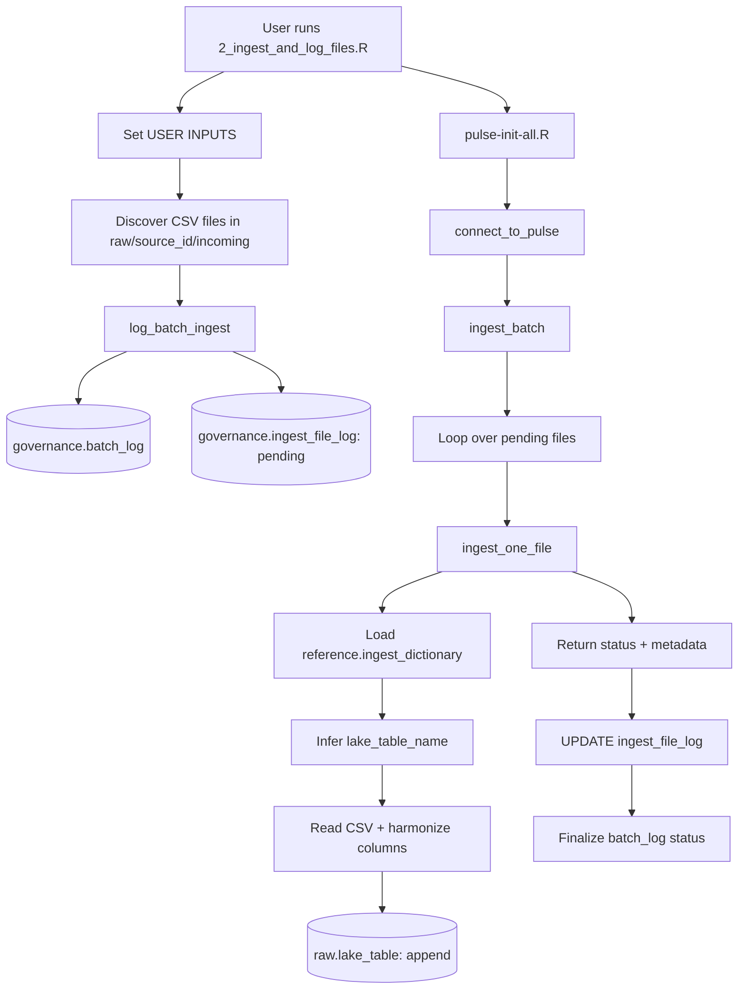
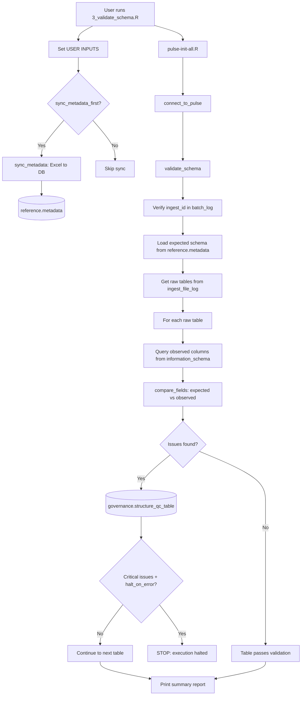

# PULSE Pipeline

A metadata-driven, automated data lake pipeline for PRIME-AI's PULSE governance framework.

Built in R and PostgreSQL, the pipeline ingests raw CSV data from multiple clinical sources, validates schemas against governed metadata definitions, and tracks every action through a comprehensive audit trail.

---

## Tech Stack

| Component | Technology |
|-----------|------------|
| Database | PostgreSQL (schema-based architecture) |
| Language | R |
| Configuration | YAML |
| Testing | testthat |
| Version Control | Git / GitHub |

---

## Prerequisites

### Environment Variables

The pipeline connects to PostgreSQL using four environment variables. Set them in your R session before running any step:

```r
Sys.setenv(PULSE_DB   = "primeai_lake")
Sys.setenv(PULSE_HOST = "localhost")
Sys.setenv(PULSE_USER = "your_username")
Sys.setenv(PULSE_PW   = "your_password")
```

### R Packages

The pipeline depends on the following R packages:

```r
install.packages(c(
  "DBI", "RPostgres", "dplyr", "tibble", "glue",
  "vroom", "readr", "readxl", "writexl", "digest",
  "fs", "yaml", "jsonlite", "uuid", "stringr", "purrr"
))
```

### Database Bootstrap

Run the initialization script once per environment to create schemas and governance tables:

```r
source("pulse-init-all.R")
```

This creates the `governance`, `reference`, `raw`, `staging`, and `validated` schemas and seeds the core governance tables (`source_registry`, `audit_log`, `pipeline_step`).

---

## Quick Start

After setting environment variables and bootstrapping the database, run the pipeline in three steps:

```r
# Step 1: Register a new data source
source("r/scripts/1_onboard_new_source.R")

# Step 2: Ingest files and log batch lineage
source("r/scripts/2_ingest_and_log_files.R")

# Step 3: Validate raw table schemas against expected metadata
source("r/scripts/3_validate_schema.R")
```

Each script has a **USER INPUT SECTION** at the top where you set parameters like `source_id`, `ingest_id`, and `source_type`.

---

## Architecture

### Database Schemas

The pipeline uses five PostgreSQL schemas:

| Schema | Purpose |
|--------|---------|
| `governance` | Pipeline control, audit trail, batch lineage, QC issues |
| `reference` | Expected schema definitions, ingest dictionaries, metadata |
| `raw` | Landing zone for ingested data (one table per source file type) |
| `staging` | Intermediate tables for transformation (future steps) |
| `validated` | Final curated, validated tables (future steps) |

### Governance Tables

| Table | Purpose | Created By |
|-------|---------|------------|
| `governance.source_registry` | Registered data sources and their metadata | Step 1 |
| `governance.audit_log` | Governed event trail (registrations, ingests, validations) | Step 1 |
| `governance.pipeline_step` | Ordered step definitions for pipeline orchestration | Bootstrap |
| `governance.batch_log` | One row per ingest batch (status, file counts, timestamps) | Step 2 |
| `governance.ingest_file_log` | One row per ingested file (checksum, row count, load status) | Step 2 |
| `governance.structure_qc_table` | Schema validation issues (missing/extra/mismatched fields) | Step 3 |

### Reference Tables

| Table | Purpose |
|-------|---------|
| `reference.metadata` | Expected schema definitions (synced from Excel dictionary) |
| `reference.ingest_dictionary` | Source-to-lake column mapping and harmonization rules |

### Reference Files (Pipeline Inputs)

The `reference/` directory contains governed metadata files that drive pipeline behavior. These are the source-of-truth Excel files that get synced to database tables at runtime.

| File | Location | Purpose | Consumed By |
|------|----------|---------|-------------|
| `CURRENT_core_metadata_dictionary.xlsx` | `reference/` | Master dictionary of all expected lake table variables, data types, and requirements. Upstream source maintained by data stewards. | Manually reviewed; serves as the governed source for `expected_schema_dictionary.xlsx` |
| `expected_schema_dictionary.xlsx` | `reference/` | Expected schema definitions for all lake tables. One row per variable per table per schema version. Synced to the `reference.metadata` database table by `sync_metadata()`. | Step 3 schema validation (via `reference.metadata` DB table) |
| `ingest_dictionary.xlsx` | `reference/` | Maps source file columns to lake table/variable names. Defines which source files map to which raw tables and how columns are harmonized. Synced to `reference.ingest_dictionary` database table. | Step 2 ingestion (`get_ingest_dict()`, `ingest_one_file()`) |
| `type_decision_table.xlsx` | `reference/type_decisions/` | Human-reviewed target SQL types for each variable. Defines what data type each column should be coerced to in the staging schema. Joined onto the expected schema during dictionary building. | Step 3A schema builder (`build_expected_schema_dictionary()`), Step 3 validation (`compare_fields()`) |
| `decision_note_reference.xlsx` | `reference/type_decisions/` | Companion notes explaining the rationale behind type decisions. Not consumed by any code — serves as governance documentation for auditors and data stewards. | Human reference only |

Prior versions of the core metadata dictionary are preserved in `reference/archive/` with timestamps in the filename.

### Profiling Outputs (Pipeline Outputs)

The `output/profiling/` directory contains artifacts generated by exploratory scripts in `r/explore/`. These are **outputs of analysis**, not inputs to the pipeline.

| File | Purpose | Generated By |
|------|---------|--------------|
| `categorical_values.csv` | Distinct values for categorical variables across raw tables. One row per variable-table combination with value counts and constrained/unconstrained status. | `r/explore/run_extract_categorical_values.R` |
| `categorical_values_consolidated.csv` | Consolidated view of categorical values per variable (combined across all tables). One row per variable. | `r/explore/run_extract_categorical_values.R` |
| `raw_ingest_profile.csv` | Structural metadata snapshot of raw tables. Documents which variables exist in which tables, used as reference for building the categorical extraction mapping. | Data profiling analysis |

### Raw Tables

Raw tables are created dynamically during Step 2 ingestion. Each source file type maps to a lake table:

```
raw.cisir_encounter
raw.cisir_vitals_minmax
raw.clarity_lab_results_ustc
raw.trauma_registry_demo_scores
...
```

Table and column names are governed by `reference.ingest_dictionary`.

---

## Pipeline Steps

### Step 1: Source Registration

**Purpose:** Register a new data source in the governed metadata ecosystem. Validates source metadata against controlled vocabularies, creates the database record, builds the folder structure, and logs the event to the audit trail.

**How to run:**

```r
source("r/scripts/1_onboard_new_source.R")
```

**Execution flow:**



**Key files:**

| File | Purpose |
|------|---------|
| `r/scripts/1_onboard_new_source.R` | User-facing wrapper script |
| `r/steps/register_source.R` | Core registration logic |
| `r/steps/run_step1_register_source.R` | Step orchestrator |
| `r/utilities/validate_source_entry.R` | Validates source metadata against vocabularies |
| `r/utilities/create_source_folders.R` | Creates raw/staging/validated directories |
| `r/steps/write_audit_event.R` | Writes governed events to audit_log |

**Database writes:**

| Table | Action |
|-------|--------|
| `governance.source_registry` | INSERT or UPDATE source record |
| `governance.audit_log` | INSERT source_registration event |
| `governance.pipeline_step` | INSERT Step 1 execution record |

**User inputs:**

| Parameter | Example | Description |
|-----------|---------|-------------|
| `source_id` | `cisir2026_toy` | Unique identifier for the data source |
| `source_name` | `CISIR Toy Data` | Human-readable name |
| `system_type` | `CSV` | One of: CSV, XLSX, SQL, API, FHIR, Other |
| `update_frequency` | `monthly` | One of: daily, weekly, biweekly, monthly, quarterly, annually, ad_hoc |
| `data_owner` | `Data Owner Name` | Responsible party |
| `ingest_method` | `manual` | One of: push, pull, api, sftp, manual |
| `pii_classification` | `PHI` | One of: PHI, Limited, NonPHI |

---

### Step 2: Batch Logging and File Ingestion

**Purpose:** Ingest raw CSV files with full batch-level and file-level lineage. Logs the ingest event, tracks each file individually, reads CSV data using dictionary-based column mapping, and appends harmonized data to raw tables.

**How to run:**

```r
source("r/scripts/2_ingest_and_log_files.R")
```

**Execution flow:**



**Key files:**

| File | Purpose |
|------|---------|
| `r/scripts/2_ingest_and_log_files.R` | User-facing wrapper script |
| `r/steps/log_batch_ingest.R` | Batch logging + `ingest_batch()` orchestrator |
| `r/steps/ingest.R` | Single-file ingestion engine (`ingest_one_file()`) |
| `r/steps/run_step2_batch_logging.R` | Programmatic step wrapper |
| `r/utilities/normalize_names.R` | Column name normalization |

**Database writes:**

| Table | Action |
|-------|--------|
| `governance.batch_log` | INSERT batch record, UPDATE with final status |
| `governance.ingest_file_log` | INSERT one row per file (pending), UPDATE with results |
| `raw.<lake_table>` | CREATE table if needed, APPEND ingested data |

**File-level lineage tracked per file:**

| Field | Description |
|-------|-------------|
| `file_name` | Original CSV filename |
| `lake_table_name` | Target raw table |
| `row_count` | Rows ingested |
| `file_size_bytes` | File size |
| `checksum` | MD5 hash for deduplication |
| `load_status` | `success`, `error`, or `pending` |

**User inputs:**

| Parameter | Example | Description |
|-----------|---------|-------------|
| `source_id` | `cisir2026_toy` | Must match a registered source from Step 1 |
| `ingest_id` | `ING_cisir2026_toy_20260128_170000` | Unique batch identifier |

The `source_type` is derived automatically from `reference.ingest_dictionary` by matching incoming filenames against `source_table_name` entries.

---

### Step 3: Schema Validation Engine

**Purpose:** Validate raw table schemas against expected metadata definitions before harmonization begins. Identifies missing columns, unexpected columns, type mismatches, primary key discrepancies, and column order drift. Writes all issues to a governed QC table.

**How to run:**

```r
source("r/scripts/3_validate_schema.R")
```

**Execution flow:**



**Key files:**

| File | Purpose |
|------|---------|
| `r/scripts/3_validate_schema.R` | User-facing wrapper script |
| `r/steps/validate_schema.R` | Core validation logic |
| `r/utilities/compare_fields.R` | Pure comparison function (detects 6 issue types) |
| `r/reference/sync_metadata.R` | Syncs expected schema from Excel to database |
| `r/reference/build_expected_schema_dictionary.R` | Builds schema dictionary from Postgres metadata |
| `r/steps/run_step3_build_expected_schema_dictionary.R` | Schema builder wrapper |
| `sql/ddl/create_STRUCTURE_QC_TABLE.sql` | DDL for the QC issues table |

**Database reads:**

| Table | Purpose |
|-------|---------|
| `governance.batch_log` | Verify ingest_id exists, derive source_id |
| `governance.ingest_file_log` | Identify which raw tables to validate |
| `reference.metadata` | Expected schema definitions (columns, types, requirements) |
| `information_schema.columns` | Actual Postgres column metadata for raw tables |

**Database writes:**

| Table | Action |
|-------|--------|
| `governance.structure_qc_table` | INSERT one row per issue found (append-only) |

**Issue types detected by `compare_fields()`:**

| Issue Code | Severity | Description |
|------------|----------|-------------|
| `SCHEMA_MISSING_COLUMN` | critical | Required column absent from raw table |
| `SCHEMA_UNEXPECTED_COLUMN` | critical | Column exists in raw but not in expected schema |
| `SCHEMA_TYPE_MISMATCH` | warning | Data type differs between expected and observed |
| `SCHEMA_PK_MISMATCH` | critical | Primary key flag differs |
| `SCHEMA_COLUMN_ORDER_DRIFT` | info | Column ordinal position differs |
| `TYPE_TARGET_MISMATCH` | warning | Observed type does not match target staging type |
| `TYPE_TARGET_MISSING` | warning | No target type defined in type_decision_table |

**Severity levels:**

| Severity | Behavior |
|----------|----------|
| `critical` | Blocks execution if `halt_on_error = TRUE` |
| `warning` | Logged but does not block |
| `info` | Informational only |

**User inputs:**

| Parameter | Example | Description |
|-----------|---------|-------------|
| `ingest_id` | `ING_cisir2026_toy_20260128_170000` | Must match an existing batch from Step 2 |
| `source_type` | `CISIR` | For logging purposes |
| `halt_on_error` | `TRUE` | Stop execution on critical issues |
| `sync_metadata_first` | `FALSE` | Re-sync Excel dictionary to database before validating |

**Reviewing issues after validation:**

```sql
SELECT * FROM governance.structure_qc_table
WHERE ingest_id = 'ING_cisir2026_toy_20260128_170000'
ORDER BY severity DESC, lake_table_name, lake_variable_name;
```

---

## Directory Structure

```
pulse-pipeline/
│
├── config/
│   ├── pipeline_settings.yml          # Controlled vocabularies, schema list, defaults
│   └── source_params.yml              # Current source parameters (written at runtime)
│
├── r/
│   ├── connect_to_pulse.R             # DB connection wrapper (reads env vars)
│   ├── runner.R                       # Pipeline orchestrator (step dispatch)
│   │
│   ├── scripts/                       # User-facing wrapper scripts
│   │   ├── 1_onboard_new_source.R
│   │   ├── 2_ingest_and_log_files.R
│   │   └── 3_validate_schema.R
│   │
│   ├── steps/                         # Core step functions
│   │   ├── register_source.R
│   │   ├── run_step1_register_source.R
│   │   ├── log_batch_ingest.R
│   │   ├── ingest.R
│   │   ├── run_step2_batch_logging.R
│   │   ├── validate_schema.R
│   │   ├── run_step3_build_expected_schema_dictionary.R
│   │   └── write_audit_event.R
│   │
│   ├── utilities/                     # Reusable helper functions
│   │   ├── compare_fields.R
│   │   ├── create_source_folders.R
│   │   ├── load_source_params.R
│   │   ├── normalize_names.R
│   │   ├── validate_source_entry.R
│   │   └── write_pipeline_step.R
│   │
│   ├── reference/                     # Metadata management
│   │   ├── build_expected_schema_dictionary.R
│   │   ├── sync_metadata.R
│   │   └── run_sync_metadata.R
│   │
│   ├── build_tools/                   # Development and maintenance utilities
│   │   ├── clear_all_governance_logs.R
│   │   ├── clear_ingest_logs.R
│   │   ├── clear_batch_logs.R
│   │   ├── drop_all_tables_in_raw_schema.R
│   │   ├── coerce_types.R
│   │   ├── create_raw_table_from_schema.R
│   │   ├── read_csv_strict.R
│   │   └── scalar_helpers.R
│   │
│   ├── explore/                       # Read-only inspection tools
│   │   ├── explore_source_registry.R
│   │   ├── explore_audit_log.R
│   │   ├── explore_batch_log.R
│   │   ├── explore_ingest_file_log.R
│   │   ├── explore_pipeline_steps.R
│   │   ├── explore_structure_qc.R
│   │   ├── explore_metadata.R
│   │   ├── explore_ingest_dictionary.R
│   │   ├── list_raw_tables.R
│   │   ├── list_ingests.R
│   │   ├── profile_data.R
│   │   ├── extract_categorical_values.R
│   │   └── run_extract_categorical_values.R
│   │
│   └── prep/                          # Test data generation
│       ├── make_toy_raw_extracts.R
│       └── bulk_deidentify_toy_files.R
│
├── sql/
│   ├── ddl/                           # Table creation scripts
│   │   ├── create_SCHEMAS.sql
│   │   ├── create_SOURCE_REGISTRY.sql
│   │   ├── create_AUDIT_LOG.sql
│   │   ├── create_PIPELINE_STEP.sql
│   │   ├── create_BATCH_LOG.sql
│   │   ├── create_INGEST_FILE_LOG.sql
│   │   ├── create_INGEST_FILE_LOG_index_1.sql
│   │   ├── create_INGEST_FILE_LOG_index_2.sql
│   │   ├── create_METADATA.sql
│   │   ├── create_STRUCTURE_QC_TABLE.sql
│   │   └── create_RULE_LIBRARY.sql
│   │
│   └── inserts/                       # Seed data
│       ├── insert_RULE_LIBRARY.sql
│       └── pipeline_steps/
│           ├── STEP_001_register_source.sql
│           └── STEP_002_batch_logging_and_ingestion.sql
│
├── tests/
│   └── testthat/
│       ├── test_step1_register_source.R
│       ├── test_step1_integration.R
│       ├── test_step2_batch_logging.R
│       ├── test_step3_schema_validation.R
│       └── helper_pulse_step1.R
│
├── docs/                              # Step documentation and SOPs
│   ├── STYLE_GUIDE.md
│   ├── function_dependency_table.md   # Cross-step function reference
│   ├── step1/                         # Each step folder has 5 files:
│   │   ├── step1_cluster1_snapshot.json
│   │   ├── step1_developer_onboarding.md
│   │   ├── step1_function_atlas.md
│   │   ├── step1_governance.md
│   │   └── step1_sop_summary.md
│   ├── step2/
│   │   ├── step2_cluster2_snapshot.json
│   │   ├── step2_developer_onboarding.md
│   │   ├── step2_function_atlas.md
│   │   ├── step2_governance.md
│   │   └── step2_sop_summary.md
│   └── step3/
│       ├── step3_cluster3_snapshot.json
│       ├── step3_developer_onboarding.md
│       ├── step3_function_atlas.md
│       ├── step3_governance.md
│       └── step3_sop_summary.md
│
├── reference/                         # Pipeline input dictionaries (tracked in git)
│   ├── CURRENT_core_metadata_dictionary.xlsx
│   ├── expected_schema_dictionary.xlsx
│   ├── ingest_dictionary.xlsx
│   ├── type_decisions/               # Type governance files
│   │   ├── type_decision_table.xlsx
│   │   └── decision_note_reference.xlsx
│   └── archive/                      # Timestamped prior versions of core dictionary
│
├── output/                            # Pipeline-generated artifacts (tracked in git)
│   └── profiling/                    # Data profiling outputs from r/explore/
│       ├── categorical_values.csv
│       ├── categorical_values_consolidated.csv
│       └── raw_ingest_profile.csv
│
├── raw/                               # Raw data zone (not tracked in git)
│   ├── cisir2026_toy/
│   ├── clarity2026_toy/
│   └── trauma_registry2026_toy/
│
├── staging/                           # Staging zone (not tracked in git)
├── validated/                         # Validated zone (not tracked in git)
│
├── pulse-init-all.R                   # Database bootstrap script
├── pulse-launch.R                     # High-level pipeline launcher
├── directory_structure.yml            # Folder template for new sources
└── CLAUDE.md                          # Build specifications
```

---

## Configuration

### pipeline_settings.yml

Located at `config/pipeline_settings.yml`. Defines controlled vocabularies used to validate source metadata during Step 1:

| Vocabulary | Allowed Values |
|------------|----------------|
| `system_type` | CSV, XLSX, SQL, API, FHIR, Other |
| `update_frequency` | daily, weekly, biweekly, monthly, quarterly, annually, ad_hoc |
| `ingest_method` | push, pull, api, sftp, manual |
| `pii_classification` | PHI, Limited, NonPHI |
| `source_types` | TRAUMA_REGISTRY, CISIR, CLARITY, EMEDS |

Also defines required source fields and default values.

### source_params.yml

Located at `config/source_params.yml`. Written automatically by `pulse_launch()` during Step 1. Contains the current source's registration parameters (source_id, source_name, system_type, etc.).

### directory_structure.yml

Located at the project root. Template used by `create_source_folders()` to build the folder structure for each new source:

```yaml
raw:
  - "{source_id}/incoming/"
  - "{source_id}/archive/"
staging:
  - "{source_id}/incoming/"
  - "{source_id}/archive/"
validated:
  - "{source_id}/"
```

---

## Development Tools

### Build Tools (`r/build_tools/`)

Destructive maintenance utilities for resetting pipeline state during development:

| Function | Purpose |
|----------|---------|
| `clear_all_governance_logs()` | TRUNCATE all 6 governance tables (FK-safe order) |
| `clear_ingest_logs()` | TRUNCATE ingest_file_log and batch_log only |
| `clear_batch_logs()` | TRUNCATE batch_log only |
| `drop_all_tables_in_raw_schema()` | DROP all tables in the raw schema |

### Explore Tools (`r/explore/`)

Read-only inspection functions for querying governance and reference tables:

| Function | Purpose |
|----------|---------|
| `explore_source_registry(con)` | Browse registered sources |
| `explore_audit_log(con)` | View audit events with filtering |
| `explore_batch_log(con)` | View ingest batches and status |
| `explore_ingest_file_log(con)` | View file-level lineage |
| `explore_pipeline_steps(con)` | View pipeline step definitions |
| `explore_structure_qc(con)` | Browse schema validation issues |
| `explore_metadata(con)` | View expected schema definitions |
| `explore_ingest_dictionary(con)` | View column harmonization rules |
| `list_raw_tables(con)` | List all raw.* tables with source mapping |
| `list_ingests(con)` | List all ingests with status summary |

---

## Testing

Unit tests are in `tests/testthat/`. Run them with:

```r
# Run all tests
testthat::test_dir("tests/testthat/")

# Run tests for a specific step
testthat::test_file("tests/testthat/test_step1_register_source.R")
testthat::test_file("tests/testthat/test_step2_batch_logging.R")
testthat::test_file("tests/testthat/test_step3_schema_validation.R")
```

Tests require a running PostgreSQL instance with the PULSE database bootstrapped.

---

## Data Protection

The `.gitignore` prevents data files from being pushed to GitHub:

- `raw/`, `staging/`, `validated/` directories
- All `.xlsx`, `.xls`, and `.csv` files **except** those explicitly allowed below
- Excel temp lock files (`~$*`)

**Tracked exceptions:**

| Path | Contents |
|------|----------|
| `reference/*.xlsx` | Pipeline input dictionaries |
| `reference/archive/*.xlsx` | Prior dictionary versions |
| `reference/type_decisions/*.xlsx` | Type governance files |
| `output/profiling/*.csv` | Data profiling outputs |

These files are tracked in git so they are versioned alongside the code that reads or generates them.
