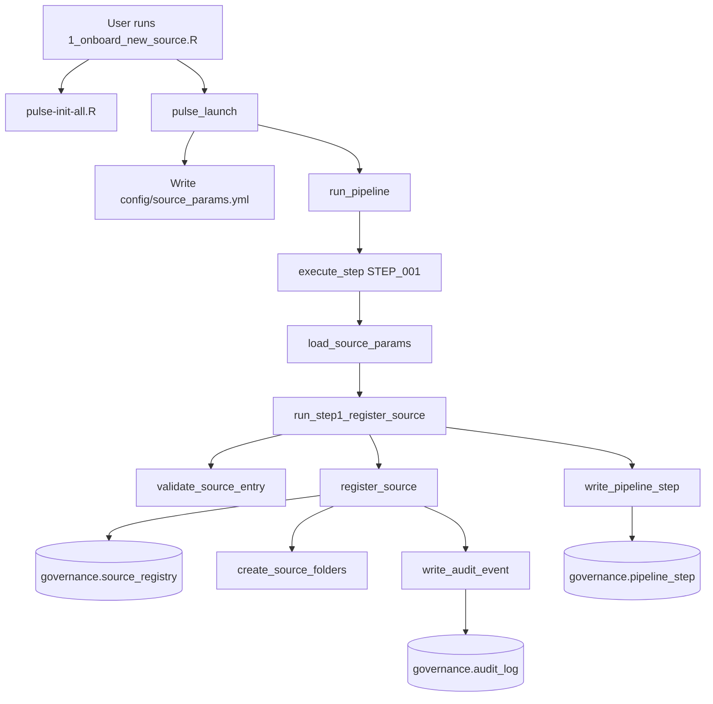
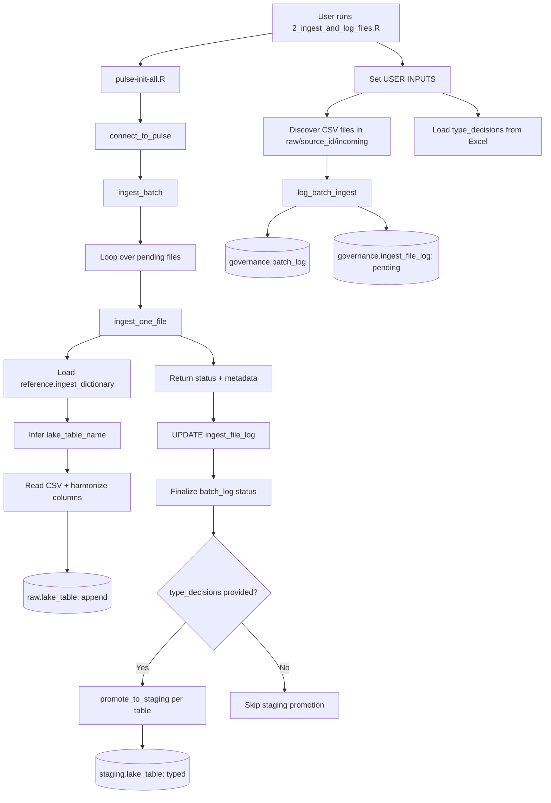
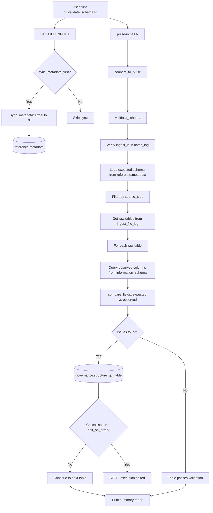
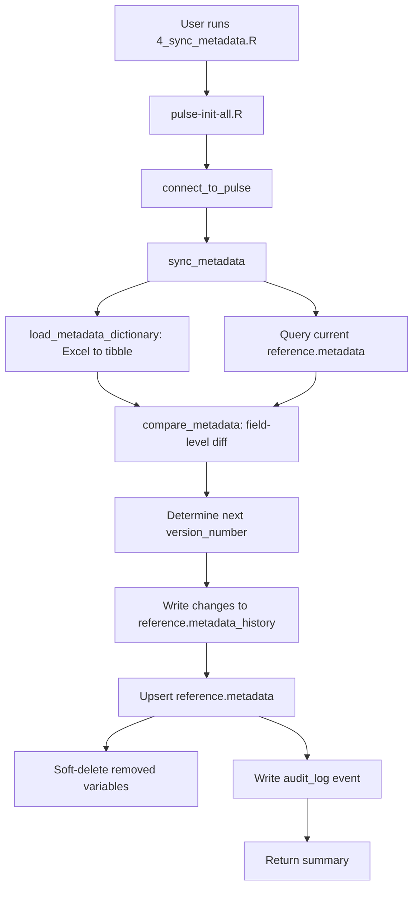
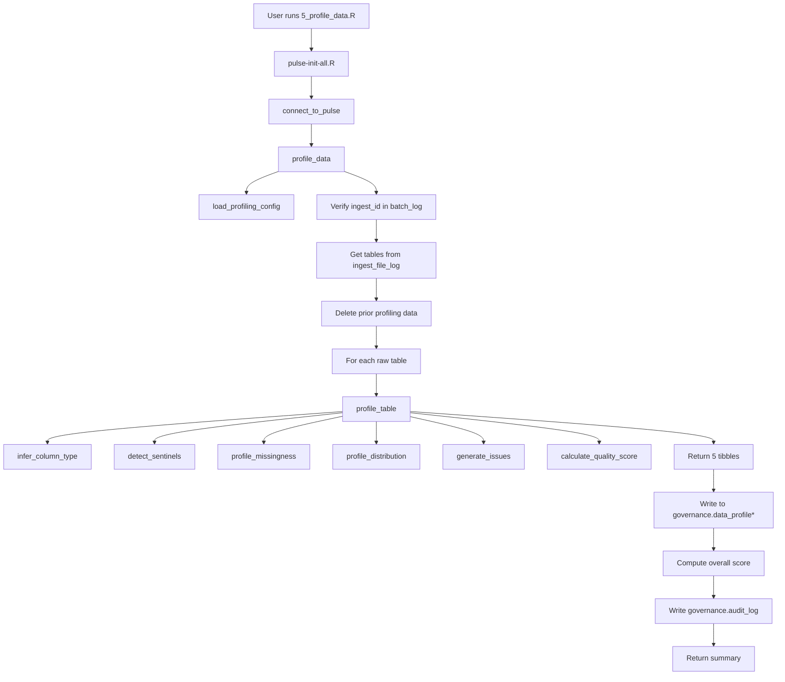
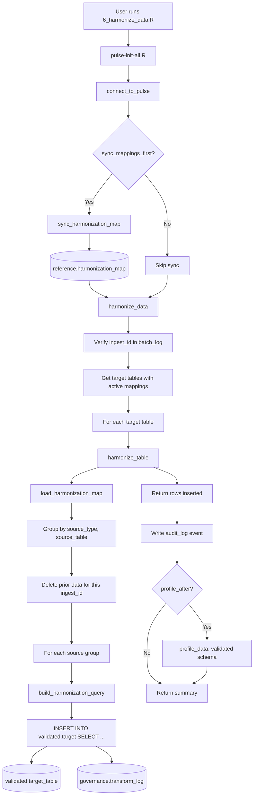

# PULSE Pipeline

A metadata-driven, automated data lake pipeline for PRIME-AI's PULSE governance framework.

Built in R and PostgreSQL, the pipeline ingests raw CSV data from multiple clinical sources, validates schemas against governed metadata definitions, synchronizes metadata dictionaries, profiles data quality, harmonizes data across sources into unified validated tables, and tracks every action through a comprehensive audit trail.

---

## Tech Stack

| Component | Technology |
|-----------|------------|
| Database | PostgreSQL (schema-based architecture) |
| Language | R |
| Configuration | YAML |
| Testing | testthat |
| Version Control | Git / GitHub |

---

## Prerequisites

### Environment Variables

The pipeline connects to PostgreSQL using four environment variables. Set them in your R session before running any step:

```r
Sys.setenv(PULSE_DB   = "primeai_lake")
Sys.setenv(PULSE_HOST = "localhost")
Sys.setenv(PULSE_USER = "your_username")
Sys.setenv(PULSE_PW   = "your_password")
```

### R Packages

The pipeline depends on the following R packages:

```r
install.packages(c(
  "DBI", "RPostgres", "dplyr", "tibble", "glue",
  "vroom", "readr", "readxl", "writexl", "digest",
  "fs", "yaml", "jsonlite", "uuid", "stringr", "purrr"
))
```

### Database Bootstrap

Run the initialization script once per environment to create schemas and governance tables:

```r
source("pulse-init-all.R")
```

This creates the `governance`, `reference`, `raw`, `staging`, and `validated` schemas and seeds the core governance tables (`source_registry`, `audit_log`, `pipeline_step`).

---

## Quick Start

After setting environment variables and bootstrapping the database, run the pipeline steps in order:

```r
# Step 1: Register a new data source
source("r/scripts/1_onboard_new_source.R")

# Step 2: Ingest files and log batch lineage
source("r/scripts/2_ingest_and_log_files.R")

# Step 3: Validate raw table schemas against expected metadata
source("r/scripts/3_validate_schema.R")

# Step 4: Synchronize metadata dictionary from Excel to database
source("r/scripts/4_sync_metadata.R")

# Step 5: Profile raw data quality (missingness, distributions, sentinels, issues)
source("r/scripts/5_profile_data.R")

# Step 6: Harmonize staging data into unified validated tables
source("r/scripts/6_harmonize_data.R")
```

Each script has a **USER INPUT SECTION** at the top where you set parameters like `source_id`, `ingest_id`, and `source_type`.

---

## Architecture

### Database Schemas

The pipeline uses five PostgreSQL schemas:

| Schema | Purpose |
|--------|---------|
| `governance` | Pipeline control, audit trail, batch lineage, QC issues, data profiling |
| `reference` | Expected schema definitions, ingest dictionaries, metadata |
| `raw` | Landing zone for ingested data (one table per source file type) |
| `staging` | Typed tables (auto-promoted from raw during ingestion via `promote_to_staging()`) |
| `validated` | Final curated, validated tables (Step 6 harmonization) |

### Governance Tables

| Table | Purpose | Created By |
|-------|---------|------------|
| `governance.source_registry` | Registered data sources and their metadata | Step 1 |
| `governance.audit_log` | Governed event trail (registrations, ingests, validations, profiling) | Step 1 |
| `governance.pipeline_step` | Ordered step definitions for pipeline orchestration | Bootstrap |
| `governance.batch_log` | One row per ingest batch (status, file counts, timestamps) | Step 2 |
| `governance.ingest_file_log` | One row per ingested file (checksum, row count, load status) | Step 2 |
| `governance.structure_qc_table` | Schema validation issues (missing/extra/mismatched fields) | Step 3 |
| `governance.data_profile` | Variable-level missingness profiling (NA, empty, whitespace, sentinel, valid) | Step 5 |
| `governance.data_profile_distribution` | Distribution statistics (numeric stats, categorical top values as JSON) | Step 5 |
| `governance.data_profile_sentinel` | Detected sentinel/placeholder values with detection method and confidence | Step 5 |
| `governance.data_profile_issue` | Quality issues flagged at critical/warning/info severity | Step 5 |
| `governance.data_profile_summary` | Per-table quality scores (Excellent, Good, Fair, Needs Review) | Step 5 |
| `governance.transform_log` | Harmonization audit trail (one row per source→target operation per ingest) | Step 6 |

### Reference Tables

| Table | Purpose |
|-------|---------|
| `reference.metadata` | Dictionary definitions synced from core metadata dictionary (version-controlled, soft deletes) |
| `reference.metadata_history` | Field-level change audit trail across metadata versions |
| `reference.ingest_dictionary` | Source-to-lake column mapping and harmonization rules |
| `reference.harmonization_map` | Column-level mappings from staging to validated tables (1,302 mappings across 23 tables) |

### Reference Files (Pipeline Inputs)

The `reference/` directory contains governed metadata files that drive pipeline behavior. These are the source-of-truth Excel files that get synced to database tables at runtime.

| File | Location | Purpose | Consumed By |
|------|----------|---------|-------------|
| `CURRENT_core_metadata_dictionary.xlsx` | `reference/` | Master dictionary of all expected lake table variables, data types, and requirements. Upstream source maintained by data stewards. Synced to `reference.metadata` by Step 4 (`sync_metadata()`). | Step 4 metadata sync (via `reference.metadata` DB table) |
| `ingest_dictionary.xlsx` | `reference/` | Maps source file columns to lake table/variable names. Defines which source files map to which raw tables and how columns are harmonized. Synced to `reference.ingest_dictionary` database table. | Step 2 ingestion (`get_ingest_dict()`, `ingest_one_file()`) |
| `type_decision_table.xlsx` | `reference/type_decisions/` | Human-reviewed target SQL types for each variable. Defines what data type each column should be coerced to in the staging schema. Used for automatic raw → staging promotion during ingestion and joined onto the expected schema during dictionary building. | Step 2 ingestion (`promote_to_staging()`), Step 3A schema builder (`build_expected_schema_dictionary()`), Step 3 validation (`compare_fields()`) |
| `decision_note_reference.xlsx` | `reference/type_decisions/` | Companion notes explaining the rationale behind type decisions. Not consumed by any code -- serves as governance documentation for auditors and data stewards. | Human reference only |

Prior versions of the core metadata dictionary are preserved in `reference/archive/` with timestamps in the filename.

### Raw Tables

Raw tables are created dynamically during Step 2 ingestion. Each source file type maps to a lake table:

```
raw.cisir_encounter
raw.cisir_vitals_minmax
raw.clarity_lab_results_ustc
raw.trauma_registry_demo_scores
...
```

Table and column names are governed by `reference.ingest_dictionary`.

---

## Pipeline Steps

### Step 1: Source Registration

**Purpose:** Register a new data source in the governed metadata ecosystem. Validates source metadata against controlled vocabularies, creates the database record, builds the folder structure, and logs the event to the audit trail.

**How to run:**

```r
source("r/scripts/1_onboard_new_source.R")
```

**Execution flow:**



**Key files:**

| File | Purpose |
|------|---------|
| `r/scripts/1_onboard_new_source.R` | User-facing wrapper script |
| `r/steps/register_source.R` | Core registration logic |
| `r/steps/run_step1_register_source.R` | Step orchestrator |
| `r/utilities/validate_source_entry.R` | Validates source metadata against vocabularies |
| `r/utilities/create_source_folders.R` | Creates raw/staging/validated directories |
| `r/steps/write_audit_event.R` | Writes governed events to audit_log |

**Database writes:**

| Table | Action |
|-------|--------|
| `governance.source_registry` | INSERT or UPDATE source record |
| `governance.audit_log` | INSERT source_registration event |
| `governance.pipeline_step` | INSERT Step 1 execution record |

**User inputs:**

| Parameter | Example | Description |
|-----------|---------|-------------|
| `source_id` | `cisir2026_toy` | Unique identifier for the data source |
| `source_name` | `CISIR Toy Data` | Human-readable name |
| `system_type` | `CSV` | One of: CSV, XLSX, SQL, API, FHIR, Other |
| `update_frequency` | `monthly` | One of: daily, weekly, biweekly, monthly, quarterly, annually, ad_hoc |
| `data_owner` | `Data Owner Name` | Responsible party |
| `ingest_method` | `manual` | One of: push, pull, api, sftp, manual |
| `pii_classification` | `PHI` | One of: PHI, Limited, NonPHI |

---

### Step 2: Batch Logging and File Ingestion

**Purpose:** Ingest raw CSV files with full batch-level and file-level lineage. Logs the ingest event, tracks each file individually, reads CSV data using dictionary-based column mapping, and appends harmonized data to raw tables.

**How to run:**

```r
source("r/scripts/2_ingest_and_log_files.R")
```

**Execution flow:**



**Key files:**

| File | Purpose |
|------|---------|
| `r/scripts/2_ingest_and_log_files.R` | User-facing wrapper script |
| `r/steps/log_batch_ingest.R` | Batch logging + `ingest_batch()` orchestrator |
| `r/steps/ingest.R` | Single-file ingestion engine (`ingest_one_file()`) |
| `r/steps/run_step2_batch_logging.R` | Programmatic step wrapper |
| `r/build_tools/promote_to_staging.R` | SQL-based raw → staging type-casting promotion |
| `r/utilities/normalize_names.R` | Column name normalization |

**Database writes:**

| Table | Action |
|-------|--------|
| `governance.batch_log` | INSERT batch record, UPDATE with final status |
| `governance.ingest_file_log` | INSERT one row per file (pending), UPDATE with results |
| `raw.<lake_table>` | CREATE table if needed, APPEND ingested data |
| `staging.<lake_table>` | DROP + CREATE via SQL CAST from raw (when `type_decisions` provided) |

**File-level lineage tracked per file:**

| Field | Description |
|-------|-------------|
| `file_name` | Original CSV filename |
| `lake_table_name` | Target raw table |
| `row_count` | Rows ingested |
| `file_size_bytes` | File size |
| `checksum` | MD5 hash for deduplication |
| `load_status` | `success`, `error`, or `pending` |

**User inputs:**

| Parameter | Example | Description |
|-----------|---------|-------------|
| `source_id` | `cisir2026_toy` | Must match a registered source from Step 1 |
| `ingest_id` | `ING_cisir2026_toy_20260128_170000` | Unique batch identifier |

The `source_type` is derived automatically from `reference.ingest_dictionary` by matching incoming filenames against `source_table_name` entries.

The script also loads `reference/type_decisions/type_decision_table.xlsx` at startup. When available, `ingest_batch()` automatically promotes each successfully ingested raw table to `staging.<lake_table>` with SQL-based type casting via `promote_to_staging()`. If the type decisions file is missing, staging promotion is skipped gracefully.

---

### Step 3: Schema Validation Engine

**Purpose:** Validate raw table schemas against expected metadata definitions before harmonization begins. Identifies missing columns, unexpected columns, type mismatches, and target type discrepancies. Filters expected schema by source type to avoid cross-source false positives. Writes all issues to a governed QC table.

**How to run:**

```r
source("r/scripts/3_validate_schema.R")
```

**Execution flow:**



**Key files:**

| File | Purpose |
|------|---------|
| `r/scripts/3_validate_schema.R` | User-facing wrapper script |
| `r/steps/validate_schema.R` | Core validation logic |
| `r/utilities/compare_fields.R` | Pure comparison function (detects 5 issue types) |
| `r/reference/sync_metadata.R` | Syncs core metadata dictionary from Excel to database (Step 4) |
| `sql/ddl/create_STRUCTURE_QC_TABLE.sql` | DDL for the QC issues table |

**Database reads:**

| Table | Purpose |
|-------|---------|
| `governance.batch_log` | Verify ingest_id exists, derive source_id |
| `governance.ingest_file_log` | Identify which raw tables to validate |
| `reference.metadata` | Expected schema definitions (columns, types, requirements) |
| `information_schema.columns` | Actual Postgres column metadata for raw tables |

**Database writes:**

| Table | Action |
|-------|--------|
| `governance.structure_qc_table` | INSERT one row per issue found (append-only) |

**Issue types detected by `compare_fields()`:**

| Issue Code | Severity | Description |
|------------|----------|-------------|
| `SCHEMA_MISSING_COLUMN` | critical | Required column absent from raw table |
| `SCHEMA_UNEXPECTED_COLUMN` | critical | Column exists in raw but not in expected schema |
| `SCHEMA_TYPE_MISMATCH` | warning | Data type differs between expected and observed |
| `TYPE_TARGET_MISMATCH` | warning | Observed type does not match target staging type |
| `TYPE_TARGET_MISSING` | warning | No target type defined in type_decision_table |

**Severity levels:**

| Severity | Behavior |
|----------|----------|
| `critical` | Blocks execution if `halt_on_error = TRUE` |
| `warning` | Logged but does not block |

**User inputs:**

| Parameter | Example | Description |
|-----------|---------|-------------|
| `ingest_id` | `ING_cisir2026_toy_20260128_170000` | Must match an existing batch from Step 2 |
| `source_type` | `CISIR` | Filters expected schema to this source; auto-derived if NULL |
| `halt_on_error` | `TRUE` | Stop execution on critical issues |
| `sync_metadata_first` | `FALSE` | Re-sync core metadata dictionary to database before validating |

**Reviewing issues after validation:**

```sql
SELECT * FROM governance.structure_qc_table
WHERE ingest_id = 'ING_cisir2026_toy_20260128_170000'
ORDER BY severity DESC, lake_table_name, lake_variable_name;
```

---

### Step 4: Metadata Synchronization

**Purpose:** Synchronize the core metadata dictionary from Excel to the database with full version tracking and field-level audit trail. Compares the new dictionary against the current database state, detects adds/updates/removes at the field level, writes change history, and upserts `reference.metadata` with a new version number.

**How to run:**

```r
source("r/scripts/4_sync_metadata.R")
```

**Execution flow:**



**Key files:**

| File | Purpose |
|------|---------|
| `r/scripts/4_sync_metadata.R` | User-facing wrapper script |
| `r/reference/sync_metadata.R` | Core sync orchestrator |
| `r/reference/load_metadata_dictionary.R` | Loads and standardizes Excel dictionary |
| `r/utilities/compare_metadata.R` | Field-level dictionary comparison |
| `r/reference/get_current_metadata_version.R` | Helper to get current version number |
| `sql/ddl/recreate_METADATA_v2.sql` | DDL for the dictionary-based metadata table |
| `sql/ddl/create_METADATA_HISTORY.sql` | DDL for the change history table |

**Database reads:**

| Table | Purpose |
|-------|---------|
| `reference.metadata` | Current dictionary state (for comparison) |

**Database writes:**

| Table | Action |
|-------|--------|
| `reference.metadata` | UPSERT (insert new, update existing, soft-delete removed) |
| `reference.metadata_history` | INSERT one row per field changed (append-only) |
| `governance.audit_log` | INSERT metadata_sync event |

**Change types detected by `compare_metadata()`:**

| Change Type | Description |
|-------------|-------------|
| `INITIAL` | First sync -- all variables are new |
| `ADD` | Variable exists in new dictionary but not in current DB |
| `UPDATE` | Variable exists in both but a field value differs |
| `REMOVE` | Variable exists in current DB but not in new dictionary |

**User inputs:**

| Parameter | Example | Description |
|-----------|---------|-------------|
| `dict_path` | `reference/CURRENT_core_metadata_dictionary.xlsx` | Path to the metadata dictionary Excel file |
| `source_type_filter` | `NULL` | Optional filter to sync only one source type |

---

### Step 5: Data Profiling

**Purpose:** Profile all raw tables from a given ingest batch to assess data quality before harmonization. Computes missingness breakdowns (NA, empty, whitespace, sentinel, valid), distribution statistics, sentinel value detection, quality issues, and per-table quality scores.

**How to run:**

```r
source("r/scripts/5_profile_data.R")
```

**Execution flow:**



**Key files:**

| File | Purpose |
|------|---------|
| `r/scripts/5_profile_data.R` | User-facing wrapper script |
| `r/steps/profile_data.R` | Step 5 orchestrator |
| `r/profiling/profile_table.R` | Table-level profiler (composes leaf functions) |
| `r/profiling/detect_sentinels.R` | Sentinel/placeholder value detection |
| `r/profiling/profile_missingness.R` | Mutually exclusive missingness classification |
| `r/profiling/profile_distribution.R` | Numeric and categorical distribution stats |
| `r/profiling/generate_issues.R` | Quality issue flagging (5 issue types) |
| `r/profiling/calculate_quality_score.R` | Per-table quality scoring |
| `r/utilities/load_profiling_config.R` | YAML config loader with defaults |
| `r/utilities/infer_column_type.R` | Column type inference (identifier, numeric, date, categorical) |
| `config/profiling_settings.yml` | Thresholds, sentinel lists, identifier patterns |
| `sql/ddl/create_DATA_PROFILE.sql` | DDL for variable-level profiling table |
| `sql/ddl/create_DATA_PROFILE_DISTRIBUTION.sql` | DDL for distribution statistics table |
| `sql/ddl/create_DATA_PROFILE_SENTINEL.sql` | DDL for sentinel detection table |
| `sql/ddl/create_DATA_PROFILE_ISSUE.sql` | DDL for quality issues table |
| `sql/ddl/create_DATA_PROFILE_SUMMARY.sql` | DDL for per-table summary table |

**Database reads:**

| Table | Purpose |
|-------|---------|
| `governance.batch_log` | Verify ingest_id exists |
| `governance.ingest_file_log` | Get successfully loaded tables for the batch |
| `raw.*` | Read table data for profiling |

**Database writes:**

| Table | Action |
|-------|--------|
| `governance.data_profile` | DELETE prior + INSERT variable-level missingness |
| `governance.data_profile_distribution` | DELETE prior + INSERT distribution stats |
| `governance.data_profile_sentinel` | DELETE prior + INSERT detected sentinels |
| `governance.data_profile_issue` | DELETE prior + INSERT quality issues |
| `governance.data_profile_summary` | DELETE prior + INSERT per-table summary |
| `governance.audit_log` | INSERT data_profiling event |

**Issue types detected by `generate_issues()`:**

| Issue Type | Severity | Trigger |
|------------|----------|---------|
| `identifier_missing` | critical | Any missing values in an identifier column |
| `high_missingness` | warning | >20% total missing (non-identifier) |
| `moderate_missingness` | info | 10-20% total missing (non-identifier) |
| `constant_value` | info | Only 1 unique valid value |
| `high_cardinality` | info | >90% unique values (non-identifier, >10 rows) |

**Quality scores:**

| Score | Max Missing % | Max Critical Issues |
|-------|---------------|---------------------|
| Excellent | <=5% | 0 |
| Good | <=10% | <=2 |
| Fair | <=20% | <=5 |
| Needs Review | >20% | >5 |

**User inputs:**

| Parameter | Example | Description |
|-----------|---------|-------------|
| `ingest_id` | `ING_cisir2026_toy_20260128_170000` | Must match an existing batch from Step 2 |
| `schema_to_profile` | `raw` | Which schema to profile: `raw` or `staging` |
| `config_path` | `config/profiling_settings.yml` | Path to profiling config (uses defaults if missing) |

**Reviewing profiling results:**

```sql
-- Per-table quality scores
SELECT table_name, quality_score, row_count, variable_count,
       avg_valid_pct, max_missing_pct, critical_issue_count
FROM governance.data_profile_summary
WHERE ingest_id = 'ING_cisir2026_toy_20260128_170000'
ORDER BY quality_score DESC;

-- Variables with highest missingness
SELECT table_name, variable_name, inferred_type,
       total_missing_pct, na_pct, sentinel_pct
FROM governance.data_profile
WHERE ingest_id = 'ING_cisir2026_toy_20260128_170000'
  AND total_missing_pct > 10
ORDER BY total_missing_pct DESC;

-- All critical and warning issues
SELECT table_name, variable_name, issue_type, severity, description
FROM governance.data_profile_issue
WHERE ingest_id = 'ING_cisir2026_toy_20260128_170000'
  AND severity IN ('critical', 'warning')
ORDER BY severity, table_name;
```

---

### Step 6: Harmonization (Staging to Validated) — *In Testing*

**Purpose:** Map data from source-specific staging tables into unified validated tables that combine data across CISIR, CLARITY, and TRAUMA_REGISTRY. Each validated table has standardized column names, a `source_type` column for provenance, and a `source_table` column identifying the exact staging origin. Column mappings are metadata-driven via `reference.harmonization_map`, which is synced from the core metadata dictionary.

**How to run:**

```r
source("r/scripts/6_harmonize_data.R")
```

**Execution flow:**



**Key files:**

| File | Purpose |
|------|---------|
| `r/scripts/6_harmonize_data.R` | User-facing wrapper script |
| `r/steps/harmonize_data.R` | Step 6 orchestrator |
| `r/harmonization/sync_harmonization_map.R` | Sync column mappings from `reference.metadata` to `reference.harmonization_map` |
| `r/harmonization/load_harmonization_map.R` | Load active mappings for a target table |
| `r/harmonization/build_harmonization_query.R` | Build SQL SELECT to transform staging data (handles direct, rename, expression, constant, coalesce transforms) |
| `r/harmonization/harmonize_table.R` | Process all source tables for one validated target |
| `r/build_tools/generate_validated_ddls.R` | Generate DDLs for all 23 validated tables from metadata dictionary |
| `sql/ddl/create_HARMONIZATION_MAP.sql` | DDL for column mapping table |
| `sql/ddl/create_TRANSFORM_LOG.sql` | DDL for harmonization audit trail |
| `sql/ddl/create_VALIDATED_*.sql` | 23 validated table DDLs (one per clinical domain) |

**Database reads:**

| Table | Purpose |
|-------|---------|
| `governance.batch_log` | Verify ingest_id exists |
| `reference.harmonization_map` | Column-level mappings (source→target) |
| `reference.metadata` | Source for mapping sync |
| `staging.*` | Source data to transform |

**Database writes:**

| Table | Action |
|-------|--------|
| `reference.harmonization_map` | UPSERT mappings from metadata dictionary |
| `validated.*` | DELETE prior ingest rows + INSERT transformed data |
| `governance.transform_log` | INSERT one row per source→target operation |
| `governance.audit_log` | INSERT harmonization event |

**Validated tables (23):**

Admission, Admission Vitals, Blood Products, Complications, Demographics, Diagnoses, Discharge, Injuries, Injury Event, Insurance, Labs, Medications, Micro Cultures, Micro Sensitivities, Patient Tracking, PMH, Prehospital Procedures, Prehospital Transport, Prehospital Vitals, Procedures, Toxicology, Trauma Scores, Vitals

**Transform types supported:**

| Type | Description |
|------|-------------|
| `direct` | Source column maps 1:1 to target (same name) |
| `rename` | Source column maps to a differently named target column |
| `expression` | Custom SQL expression applied during transform |
| `constant` | Literal value inserted for every row |
| `coalesce` | COALESCE across multiple source columns |

**User inputs:**

| Parameter | Example | Description |
|-----------|---------|-------------|
| `ingest_id` | `ING_cisir2026_toy_20260128_170418` | Must match an existing batch from Step 2 |
| `target_tables` | `NULL` | Which validated tables to populate (NULL = all with active mappings) |
| `source_type_filter` | `NULL` | Limit to one source type (NULL = all) |
| `sync_mappings_first` | `TRUE` | Re-sync mappings from metadata before harmonizing |
| `profile_after` | `TRUE` | Profile validated tables after harmonization |

**Reviewing harmonization results:**

```sql
-- Transform log summary
SELECT target_table, source_table, target_row_count, status, duration_seconds
FROM governance.transform_log
WHERE ingest_id = 'ING_cisir2026_toy_20260128_170418'
ORDER BY target_table, source_table;

-- Row counts per validated table
SELECT target_table, SUM(target_row_count) AS total_rows,
       COUNT(DISTINCT source_table) AS source_count
FROM governance.transform_log
WHERE ingest_id = 'ING_cisir2026_toy_20260128_170418'
  AND status = 'success'
GROUP BY target_table
ORDER BY target_table;
```

---

## Directory Structure

```
pulse-pipeline/
│
├── config/
│   ├── pipeline_settings.yml          # Controlled vocabularies, schema list, defaults
│   └── profiling_settings.yml         # Data profiling thresholds, sentinel lists, identifier patterns
│
├── r/
│   ├── connect_to_pulse.R             # DB connection wrapper (reads env vars)
│   ├── runner.R                       # Pipeline orchestrator (step dispatch)
│   │
│   ├── scripts/                       # User-facing wrapper scripts
│   │   ├── 1_onboard_new_source.R
│   │   ├── 2_ingest_and_log_files.R
│   │   ├── 3_validate_schema.R
│   │   ├── 4_sync_metadata.R
│   │   ├── 5_profile_data.R
│   │   └── 6_harmonize_data.R
│   │
│   ├── steps/                         # Core step functions
│   │   ├── register_source.R
│   │   ├── run_step1_register_source.R
│   │   ├── log_batch_ingest.R
│   │   ├── ingest.R
│   │   ├── run_step2_batch_logging.R
│   │   ├── validate_schema.R
│   │   ├── run_step3_build_expected_schema_dictionary.R
│   │   ├── profile_data.R
│   │   ├── harmonize_data.R
│   │   └── write_audit_event.R
│   │
│   ├── utilities/                     # Reusable helper functions
│   │   ├── compare_fields.R
│   │   ├── compare_metadata.R
│   │   ├── create_source_folders.R
│   │   ├── infer_column_type.R
│   │   ├── load_profiling_config.R
│   │   ├── load_source_params.R
│   │   ├── normalize_names.R
│   │   ├── validate_source_entry.R
│   │   └── write_pipeline_step.R
│   │
│   ├── harmonization/                 # Harmonization functions (Step 6)
│   │   ├── build_harmonization_query.R
│   │   ├── harmonize_table.R
│   │   ├── load_harmonization_map.R
│   │   └── sync_harmonization_map.R
│   │
│   ├── profiling/                     # Data quality profiling functions (Step 5)
│   │   ├── calculate_quality_score.R
│   │   ├── detect_sentinels.R
│   │   ├── generate_issues.R
│   │   ├── profile_distribution.R
│   │   ├── profile_missingness.R
│   │   └── profile_table.R
│   │
│   ├── reference/                     # Metadata management
│   │   ├── build_expected_schema_dictionary.R
│   │   ├── derive_ingest_dictionary.R
│   │   ├── get_current_metadata_version.R
│   │   ├── load_metadata_dictionary.R
│   │   ├── orchestrate_metadata_refresh.R
│   │   ├── sync_ingest_dictionary.R
│   │   ├── sync_metadata.R
│   │   └── update_type_decision_table.R
│   │
│   ├── build_tools/                   # Development, maintenance, and data prep utilities
│   │   ├── backfill_staging.R
│   │   ├── bulk_deidentify_toy_files.R
│   │   ├── clear_all_governance_logs.R
│   │   ├── clear_batch_logs.R
│   │   ├── clear_ingest_logs.R
│   │   ├── coerce_types.R
│   │   ├── create_raw_table_from_schema.R
│   │   ├── drop_all_tables_in_raw_schema.R
│   │   ├── generate_validated_ddls.R
│   │   ├── make_toy_raw_extracts.R
│   │   ├── promote_to_staging.R
│   │   ├── read_csv_strict.R
│   │   └── scalar_helpers.R
│   │
│   ├── sandbox/                       # Ad-hoc exploration scripts
│   │   ├── explore_source_registry.R
│   │   ├── explore_audit_log.R
│   │   ├── explore_batch_log.R
│   │   ├── explore_ingest_file_log.R
│   │   ├── explore_pipeline_steps.R
│   │   ├── explore_structure_qc.R
│   │   ├── explore_metadata.R
│   │   ├── explore_ingest_dictionary.R
│   │   ├── list_raw_tables.R
│   │   ├── list_ingests.R
│   │   ├── extract_categorical_values.R
│   │   ├── run_extract_categorical_values.R
│   │   └── view_validated_summary.R
│   │
│   └── review/                        # Post-step review and inspection scripts
│       ├── review_step1_sources.R
│       ├── review_step2_ingestion.R
│       ├── review_step3_validation.R
│       ├── review_step4_metadata.R
│       ├── review_step5_profiling.R
│       └── review_audit_trail.R
│
├── sql/
│   ├── ddl/                           # Table creation scripts
│   │   ├── create_SCHEMAS.sql
│   │   ├── create_SOURCE_REGISTRY.sql
│   │   ├── create_AUDIT_LOG.sql
│   │   ├── create_PIPELINE_STEP.sql
│   │   ├── create_BATCH_LOG.sql
│   │   ├── create_INGEST_FILE_LOG.sql
│   │   ├── recreate_METADATA_v2.sql
│   │   ├── create_METADATA_HISTORY.sql
│   │   ├── create_STRUCTURE_QC_TABLE.sql
│   │   ├── create_RULE_LIBRARY.sql
│   │   ├── create_DATA_PROFILE.sql
│   │   ├── create_DATA_PROFILE_DISTRIBUTION.sql
│   │   ├── create_DATA_PROFILE_SENTINEL.sql
│   │   ├── create_DATA_PROFILE_ISSUE.sql
│   │   ├── create_DATA_PROFILE_SUMMARY.sql
│   │   ├── create_HARMONIZATION_MAP.sql
│   │   ├── create_TRANSFORM_LOG.sql
│   │   └── create_VALIDATED_*.sql     # 23 validated table DDLs
│   │
│   └── inserts/                       # Seed data
│       ├── insert_RULE_LIBRARY.sql
│       └── pipeline_steps/
│           ├── STEP_001_register_source.sql
│           └── STEP_002_batch_logging_and_ingestion.sql
│
├── tests/
│   └── testthat/
│       ├── test_step1_register_source.R
│       ├── test_step1_integration.R
│       ├── test_step2_batch_logging.R
│       ├── test_step3_schema_validation.R
│       ├── test_step4_metadata_sync.R
│       ├── test_step5_data_profiling.R
│       └── helper_pulse_step1.R
│
├── docs/                              # Step documentation and SOPs
│   ├── STYLE_GUIDE.md
│   ├── function_dependency_table.md   # Cross-step function reference
│   ├── step1/                         # Each step folder has 5 files:
│   │   ├── step1_cluster1_snapshot.json
│   │   ├── step1_developer_onboarding.md
│   │   ├── step1_function_atlas.md
│   │   ├── step1_governance.md
│   │   └── step1_sop_summary.md
│   ├── step2/
│   │   ├── step2_cluster2_snapshot.json
│   │   ├── step2_developer_onboarding.md
│   │   ├── step2_function_atlas.md
│   │   ├── step2_governance.md
│   │   └── step2_sop_summary.md
│   ├── step3/
│   │   ├── step3_cluster3_snapshot.json
│   │   ├── step3_developer_onboarding.md
│   │   ├── step3_function_atlas.md
│   │   ├── step3_governance.md
│   │   └── step3_sop_summary.md
│   ├── step4/
│   │   ├── step4_cluster4_snapshot.json
│   │   ├── step4_developer_onboarding.md
│   │   ├── step4_function_atlas.md
│   │   ├── step4_governance.md
│   │   └── step4_sop_summary.md
│   ├── step5/
│   │   ├── step5_cluster5_snapshot.json
│   │   ├── step5_developer_onboarding.md
│   │   ├── step5_function_atlas.md
│   │   ├── step5_governance.md
│   │   └── step5_sop_summary.md
│   └── step6/
│       ├── step6_cluster6_snapshot.json
│       ├── step6_developer_onboarding.md
│       ├── step6_function_atlas.md
│       ├── step6_governance.md
│       ├── step6_sop_summary.md
│       └── VALIDATED_SCHEMA_OPTIONS.md
│
├── reference/                         # Pipeline input dictionaries (tracked in git)
│   ├── CURRENT_core_metadata_dictionary.xlsx
│   ├── ingest_dictionary.xlsx
│   ├── type_decisions/               # Type governance files
│   │   ├── type_decision_table.xlsx
│   │   └── decision_note_reference.xlsx
│   └── archive/                      # Timestamped prior versions of core dictionary
│
├── raw/                               # Raw data zone (not tracked in git)
│   ├── cisir2026_toy/
│   ├── clarity2026_toy/
│   └── trauma_registry2026_toy/
│
├── staging/                           # Staging zone (not tracked in git)
├── validated/                         # Validated zone (not tracked in git)
│
├── pulse-init-all.R                   # Database bootstrap script
├── pulse-launch.R                     # High-level pipeline launcher
└── directory_structure.yml            # Folder template for new sources
```

---

## Configuration

### pipeline_settings.yml

Located at `config/pipeline_settings.yml`. Defines controlled vocabularies used to validate source metadata during Step 1:

| Vocabulary | Allowed Values |
|------------|----------------|
| `system_type` | CSV, XLSX, SQL, API, FHIR, Other |
| `update_frequency` | daily, weekly, biweekly, monthly, quarterly, annually, ad_hoc |
| `ingest_method` | push, pull, api, sftp, manual |
| `pii_classification` | PHI, Limited, NonPHI |
| `source_types` | TRAUMA_REGISTRY, CISIR, CLARITY, EMEDS |

Also defines required source fields and default values.

### profiling_settings.yml

Located at `config/profiling_settings.yml`. Defines data profiling thresholds used by Step 5:

| Setting | Purpose |
|---------|---------|
| `quality_score_thresholds` | Missingness and critical issue thresholds for Excellent/Good/Fair scores |
| `missingness_thresholds` | Percentage breakpoints for critical (0%), high (20%), moderate (10%) |
| `sentinel_detection` | Numeric and string sentinel lists, min frequency %, max unique for detection |
| `identifier_columns` | Exact column names to classify as identifiers |
| `identifier_patterns` | Regex patterns to match identifier columns |
| `display` | Top N categories, decimal places |

### directory_structure.yml

Located at the project root. Template used by `create_source_folders()` to build the folder structure for each new source:

```yaml
raw:
  - "{source_id}/incoming/"
  - "{source_id}/archive/"
staging:
  - "{source_id}/incoming/"
  - "{source_id}/archive/"
validated:
  - "{source_id}/"
```

---

## Development Tools

### Build Tools (`r/build_tools/`)

Development, maintenance, and data preparation utilities. Not part of the production pipeline:

| Script | Purpose |
|--------|---------|
| `backfill_staging.R` | One-time backfill: promote all raw tables to staging using `promote_to_staging()` |
| `bulk_deidentify_toy_files.R` | De-identify toy data files for safe testing |
| `clear_all_governance_logs.R` | TRUNCATE all governance tables (FK-safe order) |
| `clear_batch_logs.R` | TRUNCATE batch_log only |
| `clear_ingest_logs.R` | TRUNCATE ingest_file_log and batch_log only |
| `coerce_types.R` | Type coercion helpers for staging table creation |
| `create_raw_table_from_schema.R` | Create raw tables from schema definitions |
| `drop_all_tables_in_raw_schema.R` | DROP all tables in the raw schema |
| `generate_validated_ddls.R` | Generate DDLs for all 23 validated tables from the metadata dictionary |
| `make_toy_raw_extracts.R` | Generate toy CSV test data from source extracts |
| `promote_to_staging.R` | Promote a single raw table to staging via SQL CAST using type_decision_table types |
| `read_csv_strict.R` | Strict CSV reader with type enforcement |
| `scalar_helpers.R` | Scalar utility functions |

### Sandbox Tools (`r/sandbox/`)

Ad-hoc exploration scripts for inspecting database state. These are not part of the production pipeline:

| Script | Purpose |
|--------|---------|
| `explore_source_registry.R` | Browse registered sources |
| `explore_audit_log.R` | View audit events with filtering |
| `explore_batch_log.R` | View ingest batches and status |
| `explore_ingest_file_log.R` | View file-level lineage |
| `explore_pipeline_steps.R` | View pipeline step definitions |
| `explore_structure_qc.R` | Browse schema validation issues |
| `explore_metadata.R` | View expected schema definitions |
| `explore_ingest_dictionary.R` | View column harmonization rules |
| `list_raw_tables.R` | List all raw.* tables with source mapping |
| `list_ingests.R` | List all ingests with status summary |
| `extract_categorical_values.R` | Extract distinct categorical values from raw tables |
| `run_extract_categorical_values.R` | Runner script for categorical value extraction |
| `view_validated_summary.R` | View row counts and column counts for all validated tables |

### Review Scripts (`r/review/`)

Post-step inspection scripts for reviewing pipeline results. Each script connects to the database, runs targeted queries, and prints a formatted summary to the console. Edit the **USER INPUT SECTION** at the top of each script to set your `ingest_id` or filters.

| Script | Purpose |
|--------|---------|
| `review_step1_sources.R` | View all registered data sources |
| `review_step2_ingestion.R` | Batch overview and file-level ingestion detail |
| `review_step3_validation.R` | Schema validation issues by table and severity |
| `review_step4_metadata.R` | Metadata state, version history, variable counts |
| `review_step5_profiling.R` | Quality scores, issues, missingness, sentinels, distributions |
| `review_audit_trail.R` | Cross-step audit log with optional ingest filtering |

---

## Testing

Unit tests are in `tests/testthat/`. Run them with:

```r
# Run all tests
testthat::test_dir("tests/testthat/")

# Run tests for a specific step
testthat::test_file("tests/testthat/test_step1_register_source.R")
testthat::test_file("tests/testthat/test_step2_batch_logging.R")
testthat::test_file("tests/testthat/test_step3_schema_validation.R")
testthat::test_file("tests/testthat/test_step4_metadata_sync.R")
testthat::test_file("tests/testthat/test_step5_data_profiling.R")
```

Tests require a running PostgreSQL instance with the PULSE database bootstrapped.

---

## Data Protection

The `.gitignore` prevents data files from being pushed to GitHub:

- `raw/`, `staging/`, `validated/` directories
- All `.xlsx`, `.xls`, and `.csv` files **except** those explicitly allowed below
- Excel temp lock files (`~$*`)

**Tracked exceptions:**

| Path | Contents |
|------|----------|
| `reference/*.xlsx` | Pipeline input dictionaries |
| `reference/archive/*.xlsx` | Prior dictionary versions |
| `reference/type_decisions/*.xlsx` | Type governance files |

These files are tracked in git so they are versioned alongside the code that reads or generates them.
