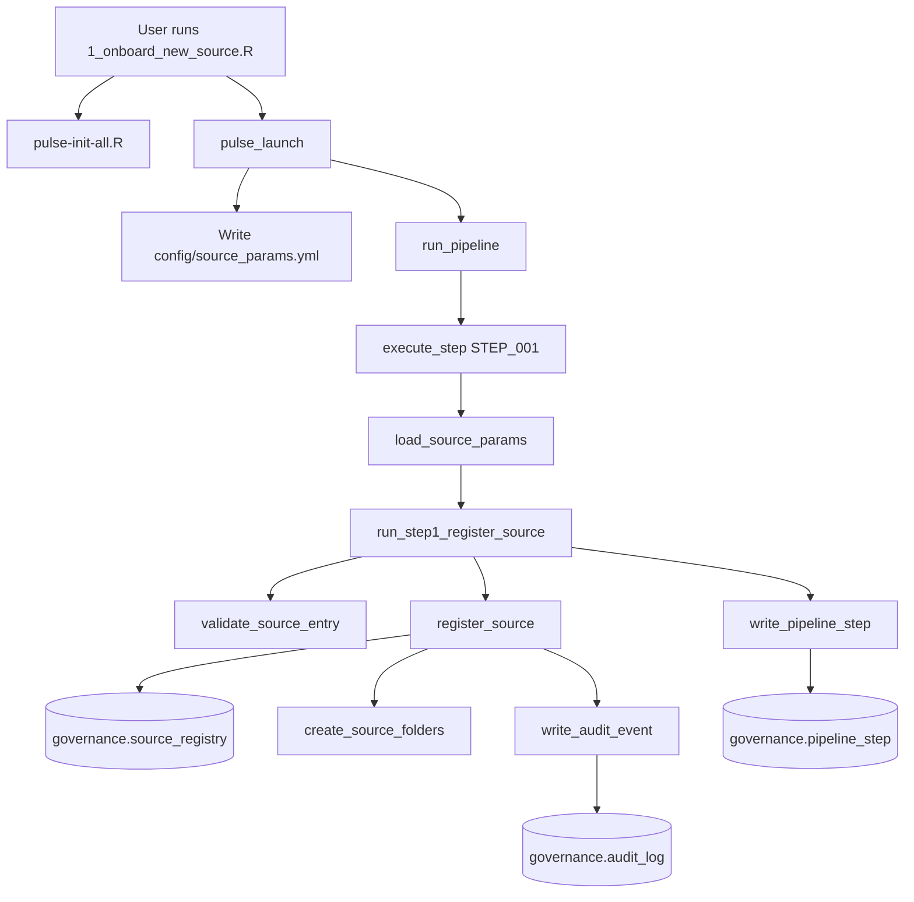

# SOP Summary — Step 1
## Source Registration

---

Step 1 is the entry point for all data sources entering the PULSE pipeline. It validates source metadata against controlled vocabularies, creates folder structures for ingest and governance, registers the source in the governance database, and writes an auditable event log.

---

## Purpose

- Validate all source metadata against controlled vocabularies defined in `config/pipeline_settings.yml`.
- Create or update a row in `governance.source_registry`.
- Build the required directory structure for the source (raw, staging, validated, governance zones).
- Write an audit log entry documenting the registration event.
- Record the pipeline step completion in `governance.pipeline_step`.

---

## Step-by-Step Summary

1. **User edits input parameters.**
   In `r/scripts/1_onboard_new_source.R`, set `ingest_id` and `source_params` (source_id, source_name, system_type, update_frequency, data_owner, ingest_method, expected_schema_version, pii_classification, etc.).

2. **Initialize PULSE system.**
   `pulse-init-all.R` sets up DB connection infrastructure, creates core schemas, and ensures governance tables exist.

3. **Launch pipeline.**
   `pulse_launch()` optionally writes `config/source_params.yml` and calls `run_pipeline()`.

4. **Execute Step 1.**
   `execute_step()` detects `STEP_001` and passes control to `run_step1_register_source()`.

5. **Validate source metadata.**
   `validate_source_entry()` checks all required fields are present and values match controlled vocabularies.

6. **Register source.**
   `register_source()` inserts or updates `governance.source_registry`, creates folders via `create_source_folders()`, and writes an audit event via `write_audit_event()`.

7. **Record step completion.**
   `write_pipeline_step()` records `STEP_001` execution in `governance.pipeline_step`.

---

## Outputs

- Row in `governance.source_registry` (insert or update)
- Folder tree under `raw/<source_id>/`, `staging/<source_id>/`, `validated/<source_id>/`, `governance/logs/`, `governance/qc/`, `governance/reports/`
- Audit log entry in `governance.audit_log` with `event_type = "source_registration"`
- Pipeline step record in `governance.pipeline_step`

---

## Mermaid Flowchart

---

## Files Involved

| Component | Path |
|-----------|------|
| User script | `r/scripts/1_onboard_new_source.R` |
| Source registration function | `r/steps/register_source.R` |
| Step wrapper | `r/steps/run_step1_register_source.R` |
| Validation helper | `r/utilities/validate_source_entry.R` |
| Folder creation utility | `r/utilities/create_source_folders.R` |
| Audit logging | `r/steps/write_audit_event.R` |
| Pipeline step writer | `r/utilities/write_pipeline_step.R` |
| Pipeline runner | `r/runner.R` |
| Vocabulary + required fields | `config/pipeline_settings.yml` |
| Folder structure template | `directory_structure.yml` |
| Unit tests | `tests/testthat/test_step1_register_source.R` |
| Integration tests | `tests/testthat/test_step1_integration.R` |

---

## Controlled Vocabularies

| Field | Allowed Values |
|-------|----------------|
| `system_type` | CSV, XLSX, SQL, API, FHIR, Other |
| `update_frequency` | daily, weekly, biweekly, monthly, quarterly, annually, ad_hoc |
| `ingest_method` | push, pull, api, sftp, manual |
| `pii_classification` | PHI, Limited, NonPHI |

---

## Completion Criteria

- Source registry entry created or updated in `governance.source_registry`
- Folder structure created successfully on disk
- Audit log entry written to `governance.audit_log`
- Pipeline step record written to `governance.pipeline_step`
- All unit tests passing
- Integration test verifies full pipeline execution

---

## Next Step

After Step 1 is complete, proceed to **Step 2: Batch Logging and File Ingestion** (`r/scripts/2_ingest_and_log_files.R`).
