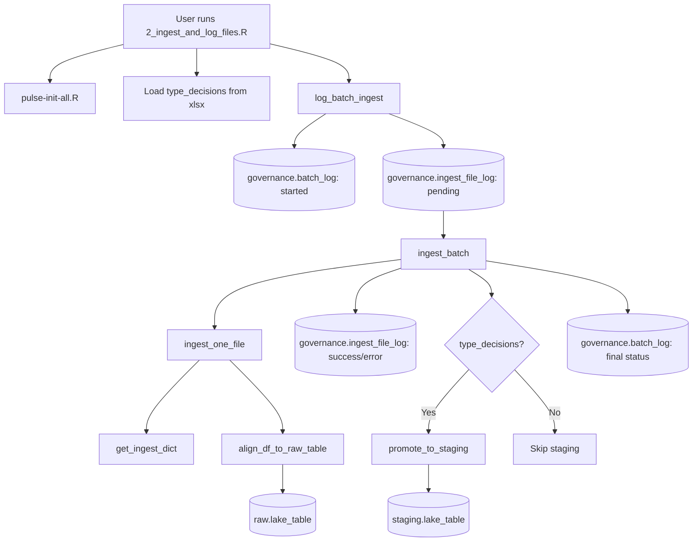

# SOP Summary — Step 2
## Batch Logging & File-Level Lineage

---

Step 2 is the ingestion gateway for all raw files entering the PULSE pipeline. It establishes batch-level lineage (`governance.batch_log`) and file-level lineage (`governance.ingest_file_log`), ingests data into the RAW zone using strict `source_type` enforcement, and optionally promotes raw tables to staging with type casting.

---

## Purpose

- Track every file involved in an ingest event with permanent lineage records.
- Create batch-level and file-level governance metadata before any data moves.
- Ingest raw CSV files into `raw.<lake_table>` using dictionary-based variable mapping.
- Enforce strict `source_type` filtering to prevent cross-source contamination.
- Optionally promote raw tables to `staging.<lake_table>` via SQL-based type casting.
- Prepare data and metadata for schema validation (Step 3).

---

## Step-by-Step Summary

1. **User edits input parameters.**
   In `r/scripts/2_ingest_and_log_files.R`, set `source_id` and `source_type`.

2. **Initialize PULSE system.**
   `pulse-init-all.R` sets up DB connection infrastructure and sources required functions.

3. **Detect incoming files.**
   All `.csv` files under `raw/<source_id>/incoming/` are discovered.

4. **Load type decisions (optional).**
   If `reference/type_decisions/type_decision_table.xlsx` exists, it is loaded for automatic staging promotion.

5. **Create batch_log entry.**
   `log_batch_ingest()` inserts a single batch row into `governance.batch_log` with status `"started"`.

6. **Create pending lineage rows.**
   One `governance.ingest_file_log` row per file, all with `load_status = "pending"`.

7. **Ingest files.**
   `ingest_batch()` calls `ingest_one_file()` for each pending file. Each file is:
   - Read via `vroom` with all columns as character
   - Matched to a `lake_table` via `reference.ingest_dictionary`
   - Filtered strictly by `source_type`
   - Harmonized (source variable names mapped to lake variable names)
   - Appended to `raw.<lake_table>` with defensive column alignment

8. **Update lineage.**
   - Success: `row_count`, `file_size_bytes`, `checksum` (MD5), `lake_table_name`, `load_status = "success"`
   - Error: `load_status = "error"` with `lake_table_name` if determinable

9. **Promote to staging (conditional).**
   If `type_decisions` are provided, each successfully ingested raw table is promoted to `staging.<lake_table>` via `promote_to_staging()`. Each column is CAST to its target type (`final_type` -> `suggested_type` -> `TEXT` fallback).

10. **Finalize batch.**
    Batch status becomes `"success"` (all files OK), `"partial"` (mixed), or `"error"` (all failed).

---

## Outputs

- Appended raw tables (`raw.<lake_table>`)
- Typed staging tables (`staging.<lake_table>`) when type_decisions available
- Batch lineage in `governance.batch_log`
- File-level lineage in `governance.ingest_file_log`
- Ready for Step 3 structural validation

---

## Mermaid Flowchart

---

## Completion Criteria

- All discovered files have lineage rows in `governance.ingest_file_log`
- No missing lineage fields for successful ingests (row_count, checksum, file_size_bytes)
- All ingestion failures properly recorded with `load_status = "error"`
- No cross-source contamination (strict `source_type` enforcement)
- Batch status correctly reflects file outcomes
- Raw data appended to appropriate tables
- Staging tables promoted when type_decisions provided

---

## Next Step

After Step 2 is complete, proceed to **Step 3: Schema Validation** (`r/scripts/3_validate_schema.R`).

---

## Files Involved

| Component | Path |
|-----------|------|
| User script | `r/scripts/2_ingest_and_log_files.R` |
| Batch logging + orchestration | `r/steps/log_batch_ingest.R` |
| Single-file ingestion | `r/steps/ingest.R` |
| Step wrapper (runner) | `r/steps/run_step2_batch_logging.R` |
| Staging promotion | `r/build_tools/promote_to_staging.R` |
| Pipeline runner | `r/runner.R` |
| Bootstrap | `pulse-init-all.R` |
| Pipeline settings | `config/pipeline_settings.yml` |
| Ingest dictionary | `reference/ingest_dictionary.xlsx` |
| Type decisions | `reference/type_decisions/type_decision_table.xlsx` |
| Batch Log DDL | `sql/ddl/create_BATCH_LOG.sql` |
| Ingest File Log DDL | `sql/ddl/create_INGEST_FILE_LOG.sql` |
| Step 2 seed data | `sql/inserts/pipeline_steps/STEP_002_batch_logging_and_ingestion.sql` |
| Unit tests | `tests/testthat/test_step2_batch_logging.R` |
