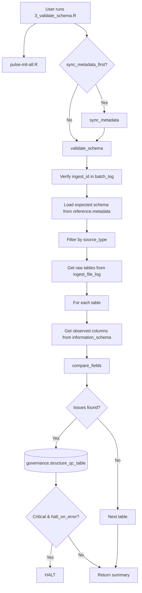

# SOP Summary — Step 3
## Schema Validation Engine

---

Step 3 validates that all ingested raw tables conform to the expected schema definitions stored in `reference.metadata`. It detects structural anomalies (missing columns, extra columns, type mismatches), classifies them by severity, and logs all issues to `governance.structure_qc_table` for governance review.

---

## Purpose

- Compare observed raw table structures against expected schema definitions in `reference.metadata`.
- Filter expected schema by `source_type` to avoid cross-source false positives.
- Detect structural anomalies: missing columns, extra columns, type mismatches, target type discrepancies.
- Classify issues by severity (`critical`, `warning`, `info`).
- Log all issues to `governance.structure_qc_table` for audit and governance.
- Optionally halt the pipeline on critical issues.
- Prepare validated data for profiling (Step 5).

---

## Step-by-Step Summary

1. **User edits input parameters.**
   In `r/scripts/3_validate_schema.R`, set `ingest_id`, `source_type`, `halt_on_error`, and `sync_metadata_first`.

2. **Initialize PULSE system.**
   `pulse-init-all.R` sets up DB connection infrastructure and sources required functions.

3. **Optional: sync metadata.**
   If `sync_metadata_first = TRUE`, re-syncs `reference.metadata` from `CURRENT_core_metadata_dictionary.xlsx`.

4. **Verify ingest_id.**
   Confirms the `ingest_id` exists in `governance.batch_log`. Derives `source_id` if not provided.

5. **Load expected schema.**
   Reads active schema definitions from `reference.metadata` (where `is_active = TRUE`), filtered by `source_type`.

6. **Identify raw tables.**
   Queries `governance.ingest_file_log` for successfully ingested tables in this batch.

7. **Validate each table.**
   For each table, gets observed columns from `information_schema.columns` and calls `compare_fields()` to check expected vs observed structure.

8. **Classify issues by severity.**
   - `critical`: Missing required columns (`SCHEMA_MISSING_COLUMN`), unexpected extra columns (`SCHEMA_UNEXPECTED_COLUMN`)
   - `warning`: Type mismatches (`SCHEMA_TYPE_MISMATCH`), target type mismatches (`TYPE_TARGET_MISMATCH`), missing target types (`TYPE_TARGET_MISSING`)

9. **Write issues.**
   All detected issues inserted into `governance.structure_qc_table`.

10. **Halt or continue.**
    If `halt_on_error = TRUE` and critical issues exist, execution stops with an error message.

---

## Outputs

- Schema comparison results for all tables in the ingest batch
- Issues logged in `governance.structure_qc_table` with severity classification
- Validation summary (tables validated, issue counts by severity)
- Ready for Step 5 data profiling

---

## Mermaid Flowchart

---

## Completion Criteria

- All tables from ingest batch validated against expected schema
- No undetected structural anomalies
- All issues logged to `governance.structure_qc_table` with proper severity
- Critical issues halt pipeline when `halt_on_error = TRUE`
- Validation reproducible via `ingest_id`
- All unit tests passing

---

## Next Step

After Step 3 is complete, proceed to **Step 4: Metadata Synchronization** (`r/scripts/4_sync_metadata.R`) or **Step 5: Data Profiling** (`r/scripts/5_profile_data.R`).

---

## Files Involved

| Component | Path |
|-----------|------|
| User script | `r/scripts/3_validate_schema.R` |
| Validation orchestrator | `r/steps/validate_schema.R` |
| Field comparison utility | `r/utilities/compare_fields.R` |
| Results review script | `r/review/review_step3_validation.R` |
| Metadata sync (Step 4) | `r/reference/sync_metadata.R` |
| Pipeline runner | `r/runner.R` |
| Bootstrap | `pulse-init-all.R` |
| Metadata dictionary | `reference/CURRENT_core_metadata_dictionary.xlsx` |
| Structure QC DDL | `sql/ddl/create_STRUCTURE_QC_TABLE.sql` |
| Metadata DDL | `sql/ddl/recreate_METADATA_v2.sql` |
| Unit tests | `tests/testthat/test_step3_schema_validation.R` |
