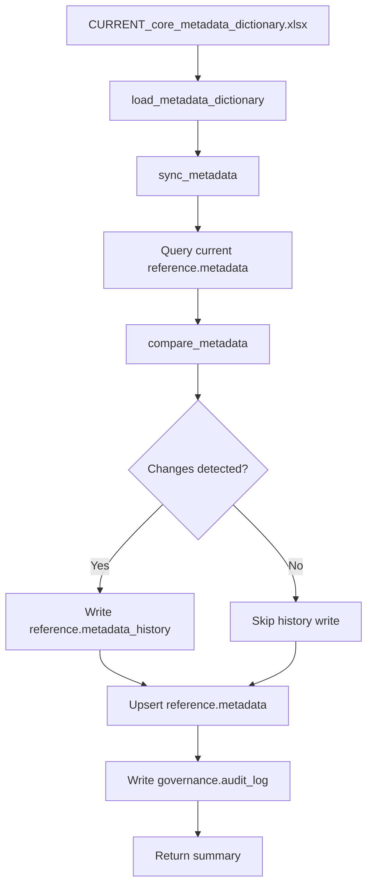

# SOP Summary — Step 4
## Metadata Synchronization

---

Step 4 ensures that the database-resident metadata dictionary (`reference.metadata`) stays in sync with the governed Excel source of truth (`CURRENT_core_metadata_dictionary.xlsx`), with full version tracking and field-level audit trail.

---

## Purpose

- Synchronize the core metadata dictionary from Excel into the database.
- Detect field-level changes (adds, updates, removes) between versions.
- Maintain a complete audit trail in `reference.metadata_history`.
- Provide version-controlled, queryable metadata for downstream steps (validation, profiling, harmonization).

---

## Step-by-Step Summary

1. **Load dictionary from Excel.**
   `load_metadata_dictionary()` reads `CURRENT_core_metadata_dictionary.xlsx`, validates required columns, standardizes Y/N fields to boolean.

2. **Query current database state.**
   `sync_metadata()` reads all active rows from `reference.metadata`.

3. **Compare dictionaries.**
   `compare_metadata()` performs field-level diff, classifying every change as INITIAL, ADD, UPDATE, or REMOVE.

4. **Determine version number.**
   New version = MAX(version_number) + 1.

5. **Write change history.**
   All detected changes are appended to `reference.metadata_history` with the new version number.

6. **Upsert metadata table.**
   New variables are inserted, existing variables are updated, removed variables are soft-deleted (`is_active = FALSE`).

7. **Write audit event.**
   A summary record is written to `governance.audit_log`.

---

## Outputs

- Updated `reference.metadata` with new version number
- Field-level change records in `reference.metadata_history`
- Audit event in `governance.audit_log`
- Console summary with version, adds, updates, removes

---

## Mermaid Flowchart

---

## Severity / Change Classifications

| Change Type | Meaning |
|-------------|---------|
| `INITIAL` | First sync — all variables are new |
| `ADD` | Variable exists in Excel but not in database |
| `UPDATE` | Variable exists in both but field value differs |
| `REMOVE` | Variable exists in database but not in Excel (soft-deleted) |

---

## Completion Criteria

- All dictionary variables synced to `reference.metadata`
- Version number incremented
- Field-level changes recorded in `reference.metadata_history`
- Removed variables soft-deleted (not physically deleted)
- Audit log event written
- No duplicate composite keys

---

## Next Step

After Step 4 is complete, proceed to **Step 5: Data Profiling** (`r/scripts/5_profile_raw_data.R`).
