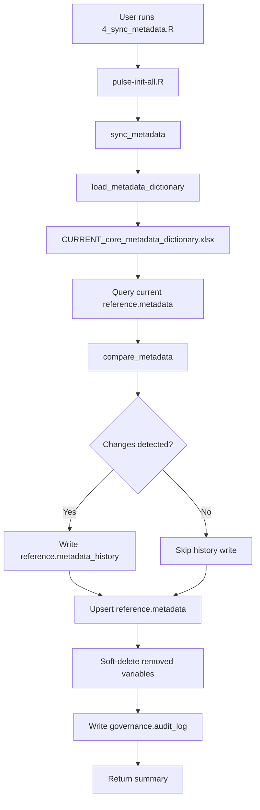

# SOP Summary — Step 4
## Metadata Synchronization

---

Step 4 ensures that the database-resident metadata dictionary (`reference.metadata`) stays in sync with the governed Excel source of truth (`CURRENT_core_metadata_dictionary.xlsx`), with full version tracking and field-level audit trail.

---

## Purpose

- Synchronize the core metadata dictionary from Excel into the database.
- Detect field-level changes (adds, updates, removes) between versions.
- Maintain a complete audit trail in `reference.metadata_history`.
- Provide version-controlled, queryable metadata for downstream steps (validation, profiling, harmonization).

---

## Step-by-Step Summary

1. **User edits input parameters.**
   In `r/scripts/4_sync_metadata.R`, set `dict_path` and `source_type_filter`.

2. **Initialize PULSE system.**
   `pulse-init-all.R` sets up DB connection infrastructure and sources required functions.

3. **Load dictionary from Excel.**
   `load_metadata_dictionary()` reads `CURRENT_core_metadata_dictionary.xlsx`, validates required columns, standardizes Y/N fields to boolean.

4. **Query current database state.**
   `sync_metadata()` reads all active rows from `reference.metadata`.

5. **Compare dictionaries.**
   `compare_metadata()` performs field-level diff, classifying every change as INITIAL, ADD, UPDATE, or REMOVE.

6. **Determine version number.**
   New version = MAX(version_number) + 1.

7. **Write change history.**
   All detected changes are appended to `reference.metadata_history` with the new version number.

8. **Upsert metadata table.**
   New variables are inserted, existing variables are updated, removed variables are soft-deleted (`is_active = FALSE`).

9. **Write audit event.**
   A summary record is written to `governance.audit_log` via `write_audit_event()`.

---

## Outputs

- Updated `reference.metadata` with new version number
- Field-level change records in `reference.metadata_history`
- Audit event in `governance.audit_log`
- Console summary with version, adds, updates, removes, duration

---

## Mermaid Flowchart

```mermaid
flowchart TD
    A[User runs 4_sync_metadata.R] --> B[pulse-init-all.R]
    B --> C[sync_metadata]
    C --> D[load_metadata_dictionary]
    D --> E[CURRENT_core_metadata_dictionary.xlsx]
    E --> F[Query current reference.metadata]
    F --> G[compare_metadata]
    G --> H{Changes detected?}
    H -->|Yes| I[Write reference.metadata_history]
    H -->|No| J[Skip history write]
    I --> K[Upsert reference.metadata]
    J --> K
    K --> L[Soft-delete removed variables]
    L --> M[Write governance.audit_log]
    M --> N[Return summary]
```

---

## Change Classifications

| Change Type | Meaning |
|-------------|---------|
| `INITIAL` | First sync — all variables are new |
| `ADD` | Variable exists in Excel but not in database |
| `UPDATE` | Variable exists in both but field value differs |
| `REMOVE` | Variable exists in database but not in Excel (soft-deleted) |

---

## Completion Criteria

- All dictionary variables synced to `reference.metadata`
- Version number incremented
- Field-level changes recorded in `reference.metadata_history`
- Removed variables soft-deleted (not physically deleted)
- Audit log event written
- No duplicate composite keys
- All unit tests passing

---

## Next Step

After Step 4 is complete, proceed to **Step 5: Data Profiling** (`r/scripts/5_profile_data.R`).

---

## Files Involved

| Component | Path |
|-----------|------|
| User script | `r/scripts/4_sync_metadata.R` |
| Sync orchestrator | `r/reference/sync_metadata.R` |
| Dictionary loader | `r/reference/load_metadata_dictionary.R` |
| Comparison engine | `r/utilities/compare_metadata.R` |
| Version helper | `r/reference/get_current_metadata_version.R` |
| Audit event writer | `r/steps/write_audit_event.R` |
| Results review | `r/review/review_step4_metadata.R` |
| Bootstrap | `pulse-init-all.R` |
| Metadata dictionary | `reference/CURRENT_core_metadata_dictionary.xlsx` |
| Metadata DDL | `sql/ddl/recreate_METADATA_v2.sql` |
| History DDL | `sql/ddl/create_METADATA_HISTORY.sql` |
| Unit tests | `tests/testthat/test_step4_metadata_sync.R` |
