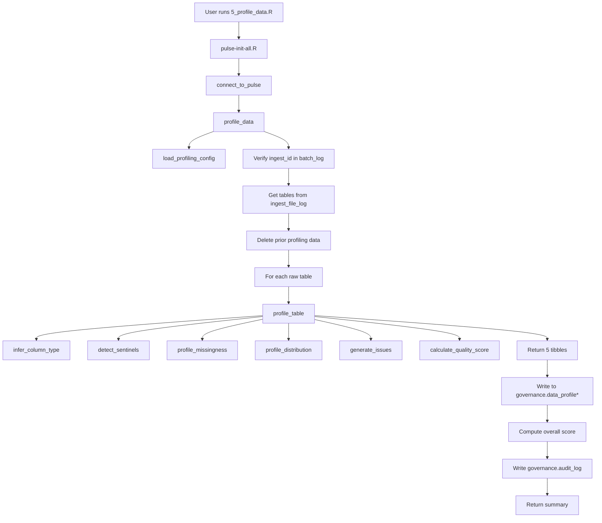

# SOP Summary — Step 5
## Data Profiling

---

Step 5 profiles all raw tables from a given ingest batch to assess data quality before harmonization. It computes missingness breakdowns, distribution statistics, sentinel value detection, quality issues, and per-table quality scores.

---

## Purpose

- Profile every column in every raw table from an ingest batch.
- Classify values into mutually exclusive categories: NA, empty, whitespace, sentinel, valid.
- Detect sentinel/placeholder values (e.g., 999, UNKNOWN) using config lists and frequency analysis.
- Compute distribution statistics appropriate to each column type (numeric stats, categorical frequencies).
- Flag quality issues at critical/warning/info severity levels.
- Calculate per-table quality scores (Excellent, Good, Fair, Needs Review).
- Write all profiling results to 5 governed database tables.

---

## Step-by-Step Summary

1. **Load profiling configuration.**
   `load_profiling_config()` reads `config/profiling_settings.yml`, merging over hardcoded defaults.

2. **Verify ingest exists.**
   Confirm the `ingest_id` exists in `governance.batch_log`.

3. **Get tables from ingest file log.**
   Query `governance.ingest_file_log` for all successfully loaded tables in the batch.

4. **Clear prior profiling data (idempotency).**
   Delete existing profiling rows for `(ingest_id, schema_name)` from all 5 profiling tables.

5. **Profile each table.**
   For each raw table, call `profile_table()` which:
   - Infers column types (numeric, categorical, date, identifier)
   - Detects sentinel values
   - Profiles missingness (mutually exclusive classification)
   - Computes distribution statistics
   - Generates quality issues
   - Calculates per-table quality score

6. **Write results to database.**
   Append profiling results to all 5 `governance.data_profile*` tables.

7. **Compute overall score.**
   Overall score is the worst per-table score across all tables.

8. **Write audit event.**
   A summary record is written to `governance.audit_log`.

---

## Outputs

- Variable-level profiling in `governance.data_profile`
- Distribution statistics in `governance.data_profile_distribution`
- Detected sentinels in `governance.data_profile_sentinel`
- Quality issues in `governance.data_profile_issue`
- Per-table summaries in `governance.data_profile_summary`
- Audit event in `governance.audit_log`
- Console summary with tables profiled, variables, sentinels, issues, overall score

---

## Mermaid Flowchart

---

## Issue Severity Classifications

| Issue Type | Severity | Trigger |
|------------|----------|---------|
| `identifier_missing` | critical | Any missing values in an identifier column |
| `high_missingness` | warning | >20% total missing (non-identifier) |
| `moderate_missingness` | info | 10-20% total missing (non-identifier) |
| `constant_value` | info | Only 1 unique valid value |
| `high_cardinality` | info | >90% unique values (non-identifier, >10 rows) |

---

## Quality Score Levels

| Score | Criteria |
|-------|----------|
| Excellent | Max missing <=5%, 0 critical issues |
| Good | Max missing <=10%, <=2 critical issues |
| Fair | Max missing <=20%, <=5 critical issues |
| Needs Review | Exceeds Fair thresholds |

---

## Completion Criteria

- 5 DDL files created and executed
- Config file created with sentinel lists and thresholds
- All R functions created (8 functions across 3 directories)
- User script runs successfully end-to-end
- Profiling results written to all 5 governance tables
- Quality scores calculated correctly
- Idempotent re-runs produce no duplicate rows
- Audit log event written
- Tests pass (168 PASS, 0 FAIL)

---

## Next Step

After Step 5 is complete, proceed to **Step 6: Harmonization** (`r/scripts/6_harmonize_data.R`).
