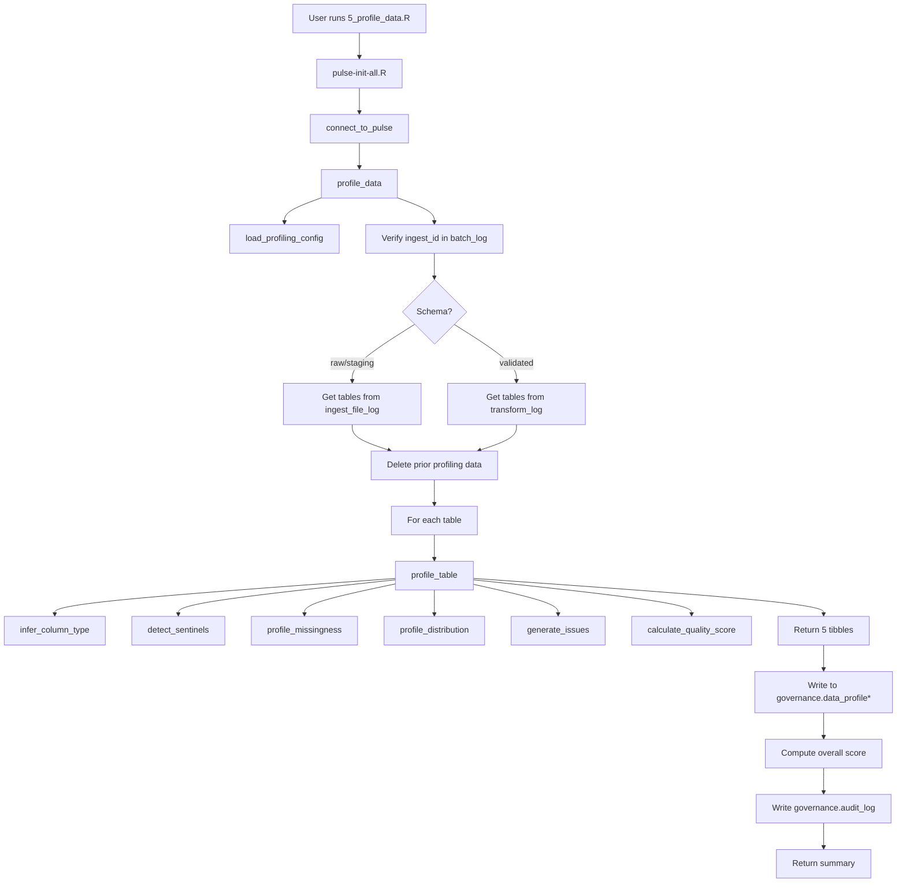

# SOP Summary — Step 5
## Data Profiling

---

Step 5 profiles all tables from a given ingest batch to assess data quality before harmonization. It computes missingness breakdowns, distribution statistics, sentinel value detection, quality issues, and per-table quality scores.

---

## Purpose

- Profile every column in every table from an ingest batch.
- Classify values into mutually exclusive categories: NA, empty, whitespace, sentinel, valid.
- Detect sentinel/placeholder values (e.g., 999, UNKNOWN) using config lists and frequency analysis.
- Compute distribution statistics appropriate to each column type (numeric stats, categorical frequencies).
- Flag quality issues at critical/warning/info severity levels.
- Calculate per-table quality scores (Excellent, Good, Fair, Needs Review).
- Write all profiling results to 5 governed database tables.

---

## Step-by-Step Summary

1. **User edits input parameters.**
   In `r/scripts/5_profile_data.R`, set `ingest_id`, `schema_to_profile`, and `config_path`.

2. **Initialize PULSE system.**
   `pulse-init-all.R` sets up DB connection infrastructure and sources required functions.

3. **Load profiling configuration.**
   `load_profiling_config()` reads `config/profiling_settings.yml`, merging over hardcoded defaults.

4. **Verify ingest exists.**
   Confirm the `ingest_id` exists in `governance.batch_log`.

5. **Get tables to profile.**
   Query `governance.ingest_file_log` (for raw/staging) or `governance.transform_log` (for validated) for all successfully loaded tables in the batch.

6. **Clear prior profiling data (idempotency).**
   Delete existing profiling rows for `(ingest_id, schema_name)` from all 5 profiling tables.

7. **Profile each table.**
   For each table, call `profile_table()` which:
   - Infers column types (numeric, categorical, date, identifier)
   - Detects sentinel values
   - Profiles missingness (mutually exclusive classification)
   - Computes distribution statistics
   - Generates quality issues
   - Calculates per-table quality score

8. **Write results to database.**
   Append profiling results to all 5 `governance.data_profile*` tables.

9. **Compute overall score.**
   Overall score is the worst per-table score across all tables.

10. **Write audit event.**
    A summary record is written to `governance.audit_log` via `write_audit_event()`.

---

## Outputs

- Variable-level profiling in `governance.data_profile`
- Distribution statistics in `governance.data_profile_distribution`
- Detected sentinels in `governance.data_profile_sentinel`
- Quality issues in `governance.data_profile_issue`
- Per-table summaries in `governance.data_profile_summary`
- Audit event in `governance.audit_log`
- Console summary with tables profiled, variables, sentinels, issues, overall score

---

## Mermaid Flowchart

```mermaid
flowchart TD
    A[User runs 5_profile_data.R] --> B[pulse-init-all.R]
    B --> C[connect_to_pulse]
    C --> D[profile_data]
    D --> E[load_profiling_config]
    D --> F[Verify ingest_id in batch_log]
    F --> G{Schema?}
    G -->|raw/staging| G1[Get tables from ingest_file_log]
    G -->|validated| G2[Get tables from transform_log]
    G1 --> H[Delete prior profiling data]
    G2 --> H
    H --> I[For each table]
    I --> J[profile_table]
    J --> J1[infer_column_type]
    J --> J2[detect_sentinels]
    J --> J3[profile_missingness]
    J --> J4[profile_distribution]
    J --> J5[generate_issues]
    J --> J6[calculate_quality_score]
    J --> K[Return 5 tibbles]
    K --> L[Write to governance.data_profile*]
    L --> M[Compute overall score]
    M --> N[Write governance.audit_log]
    N --> O[Return summary]
```

---

## Issue Severity Classifications

| Issue Type | Severity | Trigger |
|------------|----------|---------|
| `identifier_missing` | critical | Any missing values in an identifier column |
| `high_missingness` | warning | >20% total missing (non-identifier) |
| `moderate_missingness` | info | 10-20% total missing (non-identifier) |
| `constant_value` | info | Only 1 unique valid value |
| `high_cardinality` | info | >90% unique values (non-identifier, >10 rows) |

---

## Quality Score Levels

| Score | Criteria |
|-------|----------|
| Excellent | Max missing <=5%, 0 critical issues |
| Good | Max missing <=10%, <=2 critical issues |
| Fair | Max missing <=20%, <=5 critical issues |
| Needs Review | Exceeds Fair thresholds |

---

## Completion Criteria

- 5 DDL files created and executed
- Config file created with sentinel lists and thresholds
- All R functions created (9 functions across 3 directories)
- User script runs successfully end-to-end
- Profiling results written to all 5 governance tables
- Quality scores calculated correctly
- Idempotent re-runs produce no duplicate rows
- Audit log event written
- All unit tests passing

---

## Next Step

After Step 5 is complete, proceed to **Step 6: Harmonization** (`r/scripts/6_harmonize_data.R`).

---

## Files Involved

| Component | Path |
|-----------|------|
| User script | `r/scripts/5_profile_data.R` |
| Profiling orchestrator | `r/steps/profile_data.R` |
| Table profiler | `r/profiling/profile_table.R` |
| Sentinel detection | `r/profiling/detect_sentinels.R` |
| Missingness profiler | `r/profiling/profile_missingness.R` |
| Distribution profiler | `r/profiling/profile_distribution.R` |
| Issue generator | `r/profiling/generate_issues.R` |
| Quality scorer | `r/profiling/calculate_quality_score.R` |
| Config loader | `r/utilities/load_profiling_config.R` |
| Type inference | `r/utilities/infer_column_type.R` |
| Audit event writer | `r/steps/write_audit_event.R` |
| Results review | `r/review/review_step5_profiling.R` |
| Bootstrap | `pulse-init-all.R` |
| Profiling config | `config/profiling_settings.yml` |
| Profile DDL | `sql/ddl/create_DATA_PROFILE.sql` |
| Distribution DDL | `sql/ddl/create_DATA_PROFILE_DISTRIBUTION.sql` |
| Sentinel DDL | `sql/ddl/create_DATA_PROFILE_SENTINEL.sql` |
| Issue DDL | `sql/ddl/create_DATA_PROFILE_ISSUE.sql` |
| Summary DDL | `sql/ddl/create_DATA_PROFILE_SUMMARY.sql` |
| Unit tests | `tests/testthat/test_step5_data_profiling.R` |
