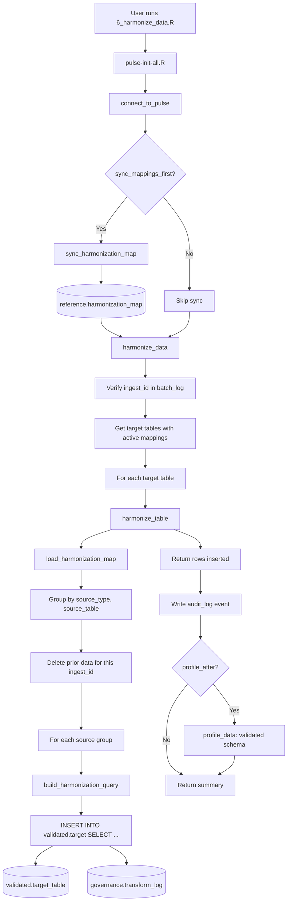

# SOP Summary — Step 6
## Harmonization (Staging to Validated)

---

Step 6 harmonizes staging tables from multiple clinical data sources (CISIR, CLARITY, TRAUMA_REGISTRY) into unified validated tables. Column mappings are metadata-driven, sourced from the core metadata dictionary via `reference.harmonization_map`. Each validated row is tagged with `source_type` and `source_table` provenance.

---

## Purpose

- Map source-specific staging tables into 23 unified validated tables.
- Apply column-level mappings (direct, rename, expression, constant, coalesce) to transform staging data.
- Tag every row with `source_type`, `source_table`, and `ingest_id` for provenance tracking.
- Log each source-to-target operation in `governance.transform_log`.
- Support idempotent re-runs — prior ingest data is deleted before re-harmonization.
- Optionally re-profile validated tables using Step 5 profiling.

---

## Step-by-Step Summary

1. **Sync harmonization mappings (optional).**
   `sync_harmonization_map()` reads `reference.metadata` and materializes column-level mappings into `reference.harmonization_map`. Expands comma-separated `validated_table_target` values for shared identifiers.

2. **Verify ingest exists.**
   Confirm the `ingest_id` exists in `governance.batch_log`.

3. **Determine target tables.**
   Query `reference.harmonization_map` for all validated tables with active mappings, or use a user-specified subset.

4. **Process each validated table.**
   For each target table, `harmonize_table()`:
   - Loads active mappings for that target
   - Groups mappings by `(source_type, source_table)`
   - Deletes prior data for this `ingest_id` (idempotency)
   - For each source group:
     - Verifies the staging table exists
     - Builds a SQL SELECT via `build_harmonization_query()`
     - Executes `INSERT INTO validated.{table} SELECT ...`
     - Logs the operation to `governance.transform_log`

5. **Write audit event.**
   A summary record is written to `governance.audit_log`.

6. **Profile validated tables (optional).**
   If `profile_after = TRUE`, re-runs Step 5 profiling against the validated schema.

---

## Outputs

- Populated `validated.*` tables (23 clinical domain tables)
- Transform audit trail in `governance.transform_log`
- Audit event in `governance.audit_log`
- Console summary with tables harmonized, rows inserted, sources processed
- Optional profiling results in `governance.data_profile*` tables

---

## Mermaid Flowchart

---

## Transform Types

| Type | Description | Example |
|------|-------------|---------|
| `direct` | Source column maps 1:1 to target (same name) | `account_number` -> `account_number` |
| `rename` | Source column maps to a differently named target | `medrecno` -> `mrn` |
| `expression` | Custom SQL expression applied during transform | `(COALESCE(col1, col2))` |
| `constant` | Literal value inserted for every row | `'CISIR'` |
| `coalesce` | COALESCE across multiple source columns | `COALESCE(bp_sys, systolic_bp)` |

---

## Type Casting

When the staging column type differs from the validated column type, `build_harmonization_query()` applies safe casting:

- **TEXT to NUMERIC**: Uses regex guard `CASE WHEN col ~ '^-?[0-9]*\.?[0-9]+([eE][+-]?[0-9]+)?$' THEN CAST(...) ELSE NULL END` to handle dirty values like "Negative", "<0.02", "0-2".
- **Other type mismatches**: Uses direct `CAST(col AS type)`.
- **Missing source columns**: Mapped as `NULL` with a warning.

---

## Validated Tables (23)

Admission, Admission Vitals, Blood Products, Complications, Demographics, Diagnoses, Discharge, Injuries, Injury Event, Insurance, Labs, Medications, Micro Cultures, Micro Sensitivities, Patient Tracking, PMH, Prehospital Procedures, Prehospital Transport, Prehospital Vitals, Procedures, Toxicology, Trauma Scores, Vitals

---

## Completion Criteria

- 23 validated table DDLs created and executed
- 2 governance DDLs created (harmonization_map, transform_log)
- All R functions created (4 harmonization functions + 1 orchestrator)
- User script runs successfully end-to-end
- Mappings sync correctly from metadata dictionary (1,302 mappings)
- Data inserted into validated tables with correct provenance columns
- Transform log records every source-to-target operation
- Idempotent re-runs produce no duplicate rows
- Audit log event written
- Validated tables can be profiled using Step 5

---

## Next Step

After Step 6 is complete, proceed to **Step 7: QC Rule Execution** (`r/scripts/7_execute_qc_rules.R`).
